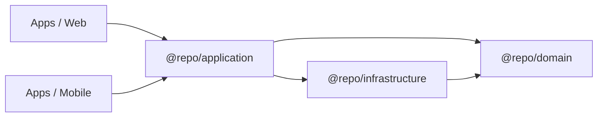

# Vita Product Boilerplate

A high-performance monorepo boilerplate for building professional-grade web and mobile applications using **Advanced Clean Architecture**, **SOLID principles**, and **Functional Patterns**.

## 🚀 Purpose

The goal of this project is to provide a rock-solid, scalable foundation for cross-platform products. It enforces a strict separation of concerns, ensuring that business logic is written once and shared across web (Next.js) and mobile (Expo) apps, while maintaining high testability and type-safety.

## 🏗️ Architecture

This boilerplate implements **Advanced Clean Architecture**. The "intelligence" of the application is centralized in shared packages, leaving the apps as thin presentation layers.

### Layer Structure



| Package                    | Responsibility                                                  | Technologies        |
| :------------------------- | :-------------------------------------------------------------- | :------------------ |
| **`@repo/domain`**         | Core business logic, Entities (Zod), and Repository Interfaces. | TypeScript, Zod     |
| **`@repo/application`**    | Pure Use Cases and orchestration hooks.                         | TypeScript, React   |
| **`@repo/infrastructure`** | Technical implementations (API, Storage, Adapters).             | Apollo Client, Zod  |
| **`@repo/graphql`**        | Generated GraphQL types and documents.                          | GraphQL Codegen     |
| **`@repo/ui`**             | Shared design system and UI primitives.                         | React, Tailwind/CSS |

### Key Professional Patterns

- **Zod as Source of Truth**: Entities are defined via Zod schemas for runtime validation and static type inference.
- **Functional Result Pattern**: Error handling is treated as data, avoiding unexpected exceptions.
- **Dependency Inversion**: High-level application logic depends on abstract repository interfaces, not concrete implementations.
- **Single Source of Truth**: Business rules and data fetching logic are shared between Web and Mobile.

---

## 📦 Project Structure

```text
.
├── apps/
│   ├── api/          # NestJS GraphQL API
│   ├── web/          # Next.js Presentation Layer
│   └── mobile/       # Expo/React Native Presentation Layer
├── packages/
│   ├── domain/       # Shared Domain Layer (Entities + Interfaces)
│   ├── application/  # Shared Application Layer (Use Cases + Hooks)
│   ├── infrastructure/# Shared Infrastructure Layer (Apollo Repositories)
│   ├── graphql/      # Shared GraphQL types/codegen
│   ├── ui/           # Shared UI Components
│   └── config/       # Shared ESLint, Prettier, and TS configs
└── .cursor/rules/    # Cursor IDE architecture enforcement rules
```

---

## 🛠️ Getting Started

### Prerequisites

- [Node.js](https://nodejs.org/) (>= 20)
- [pnpm](https://pnpm.io/) (>= 9)

### Installation

```bash
pnpm install
```

### Development

To start all applications (API, Web, Mobile) in development mode:

```bash
pnpm dev
```

### Type Checking & Linting

```bash
pnpm check-types
pnpm lint
```

### Code Generation (GraphQL)

```bash
pnpm generate
```

---

## 📚 Documentation

- **Start here (EN)**: [`docs/README.en.md`](./docs/README.en.md)
- **Comece aqui (PT)**: [`docs/README.pt.md`](./docs/README.pt.md)
- **Cursor rules (architecture + TDD)**: [`./.cursor/rules/`](./.cursor/rules/)
- Turborepo: `https://turborepo.com/docs`

---

## 🛡️ License

This project is licensed under the MIT License.
