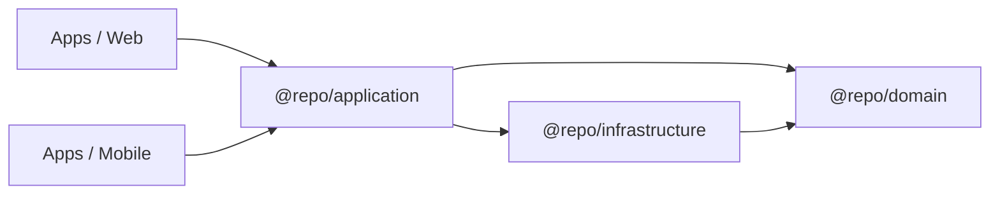

# Vita Product Boilerplate

A high-performance monorepo boilerplate for building professional-grade web applications using **Advanced Clean Architecture**, **SOLID principles**, and **Functional Patterns**.

---

> ⚠️ **IMPORTANT: Example Feature Included**
>
> This boilerplate includes a `Tasks` feature as an **educational example** to demonstrate
> the architecture patterns. **Remove it before building your product.**
>
> 🧹 **To start clean:** `pnpm clean:example` or `./scripts/clean-example.sh`
>
> 📚 **See:** [Starting a Clean Project](./docs/getting-started/clean-slate.en.md)

---

## 🎯 How to Use This Boilerplate

### Option 1: Learn the Architecture (Keep Example)

Study the `Tasks` feature to understand how Clean Architecture works:

```bash
git clone <repo-url>
pnpm install
pnpm dev
```

Explore the code in `packages/{domain,application,infrastructure}/src/features/tasks/`.

### Option 2: Start a New Product (Remove Example)

Start fresh without the example code:

```bash
git clone <repo-url>
pnpm install
pnpm clean:example           # Remove Tasks example
./scripts/verify-clean.sh    # Verify clean state
./scripts/generate-feature.sh my-feature  # Create your first feature
pnpm dev
```

---

## 🚀 Purpose

The goal of this project is to provide a rock-solid, scalable foundation for web products. It enforces a strict separation of concerns, ensuring that business logic is written once and shared across the application, while maintaining high testability and type-safety.

## 🏗️ Architecture

This boilerplate implements **Advanced Clean Architecture**. The "intelligence" of the application is centralized in shared packages, leaving the apps as thin presentation layers.

### Layer Structure



| Package                    | Responsibility                                                  | Technologies        |
| :------------------------- | :-------------------------------------------------------------- | :------------------ |
| **`@repo/domain`**         | Core business logic, Entities (Zod), and Repository Interfaces. | TypeScript, Zod     |
| **`@repo/application`**    | Pure Use Cases and orchestration hooks.                         | TypeScript, React   |
| **`@repo/infrastructure`** | Technical implementations (API, Storage, Adapters).             | Apollo Client, Zod  |
| **`@repo/graphql`**        | Generated GraphQL types and documents.                          | GraphQL Codegen     |
| **`@repo/ui`**             | Shared design system and UI primitives.                         | React, Tailwind/CSS |

### Key Professional Patterns

- **Zod as Source of Truth**: Entities are defined via Zod schemas for runtime validation and static type inference.
- **Functional Result Pattern**: Error handling is treated as data, avoiding unexpected exceptions.
- **Dependency Inversion**: High-level application logic depends on abstract repository interfaces, not concrete implementations.
- **Apollo Client with Normalized Cache**: GraphQL client with automatic caching, dedupe, and background refetch for optimal UX.
- **Composition Root**: Centralized dependency injection via factories and providers, eliminating scattered `new` calls.
- **Single Source of Truth**: Business rules and data fetching logic are centralized in shared packages.

---

## 📦 Project Structure

This project uses a **Feature-Based Architecture** combining Clean Architecture with Feature-Sliced Design.

```text
.
├── apps/
│   ├── api/              # NestJS GraphQL API
│   ├── mobile/           # Expo React Native App
│   └── web/              # Next.js Presentation Layer
├── packages/
│   ├── domain/src/
│   │   ├── features/     # Feature slices (tasks*, auth, etc.)
│   │   │   └── tasks/    # ⚠️ EXAMPLE - Remove before production
│   │   └── shared/       # Cross-cutting (Result, Errors)
│   ├── application/src/
│   │   ├── features/     # Feature slices
│   │   │   └── tasks/    # ⚠️ EXAMPLE - Remove before production
│   │   └── shared/       # Cross-feature utilities
│   ├── infrastructure/src/
│   │   ├── features/     # Feature slices
│   │   │   └── tasks/    # ⚠️ EXAMPLE - Remove before production
│   │   └── shared/       # Shared infra (Apollo config)
│   ├── graphql/          # Shared GraphQL types/codegen
│   ├── ui/               # Shared UI Components
│   └── config/           # Shared ESLint, Prettier, and TS configs
├── scripts/
│   ├── generate-feature.sh  # Feature generator script
│   ├── clean-example.sh     # Remove example Tasks feature
│   └── verify-clean.sh      # Verify clean state
└── .cursor/rules/        # Cursor IDE architecture enforcement rules
```

### Adding a New Feature

```bash
./scripts/generate-feature.sh auth
# Creates packages/{domain,application,infrastructure}/src/features/auth/
```

---

## 🛠️ Getting Started

### Prerequisites

- [Node.js](https://nodejs.org/) (>= 20)
- [pnpm](https://pnpm.io/) (>= 9)

### Installation

```bash
pnpm install
```

### Development

To start all applications (API, Web) in development mode:

```bash
pnpm dev
```

To start the mobile app:

```bash
cd apps/mobile
npx expo start --tunnel
```

### Type Checking & Linting

```bash
pnpm check-types
pnpm lint
```

### Testing

The project uses **Vitest** for testing:

- **Vitest** for packages (`domain`, `application`, `infrastructure`) and `web`
- **Jest** for `api` (NestJS)

```bash
# Run all tests
pnpm test

# Run tests for specific package
pnpm --filter @repo/domain test
pnpm --filter @repo/application test
```

See [`docs/testing/setup.en.md`](./docs/testing/setup.en.md) for details.

### Code Generation (GraphQL)

```bash
pnpm generate
```

### Cleanup Scripts

```bash
# Remove example Tasks feature
pnpm clean:example

# Verify clean state
pnpm verify:clean
```

---

## 📚 Documentation

- **Start here (EN)**: [`docs/README.en.md`](./docs/README.en.md)
- **Comece aqui (PT)**: [`docs/README.pt.md`](./docs/README.pt.md)
- **Getting Started**:
  - [Starting a Clean Project](./docs/getting-started/clean-slate.en.md) ⭐ NEW
- **Architecture**:
  - [Feature-Based Architecture](./docs/architecture/feature-based.en.md)
  - [Public API Pattern](./docs/patterns/public-api.en.md)
  - [Apollo Client](./docs/architecture/apollo-client.en.md)
  - [Composition Root Pattern](./docs/patterns/composition-root.en.md)
  - [Testing Setup](./docs/testing/setup.en.md)
- **Workflows**:
  - [Adding a Feature](./docs/workflows/adding-a-feature.en.md)
- **Cursor rules (architecture + TDD)**: [`./.cursor/rules/`](./.cursor/rules/)
- Turborepo: `https://turborepo.com/docs`

---

## 🛡️ License

This project is licensed under the MIT License.
