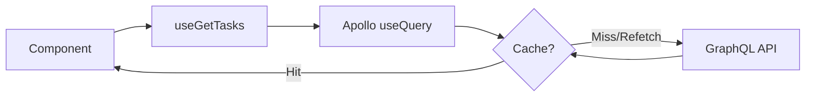

# Apollo Client - Architecture

## Purpose

This document explains why we chose **Apollo Client** as our GraphQL state management solution and how it integrates with the project's Clean Architecture.

## Why Apollo Client?

### 1. GraphQL Native

The project uses **GraphQL end-to-end** (NestJS GraphQL API + codegen). Apollo Client is the most mature and complete solution for GraphQL in the React ecosystem.

### 2. Normalized Cache

Apollo maintains a **normalized cache** that:
- Stores each entity only once (by `id` and `__typename`)
- Automatically updates all queries using that entity
- Avoids data duplication in memory

**Example:**
```typescript
// Query 1: task list
{ tasks { id, title } }

// Query 2: task detail
{ task(id: "1") { id, title, completed } }

// Both share the same object in cache!
```

### 3. Dedupe and Background Refetch

- **Dedupe**: multiple components calling the same query simultaneously → only 1 request
- **Background refetch**: shows cached data immediately, updates in background

### 4. Configurable Fetch Policies

Apollo offers fine-grained control over when to fetch data:

| Policy | Behavior |
|--------|----------|
| `cache-first` | Uses cache if available, only fetches if missing |
| `cache-and-network` | Returns cache immediately + fetches update |
| `network-only` | Always fetches from network, ignores cache |
| `no-cache` | Doesn't use cache (useful for sensitive data) |

**In this project, we use `cache-and-network` by default** for better UX.

## How It Works in the Project

### 1. Configuration (Composition Root)

```typescript
// apps/web/src/infrastructure/graphql/apollo-client.ts
import { ApolloClient, InMemoryCache, HttpLink } from '@apollo/client';
import { API_CONFIG } from '@repo/config/env';

export const apolloClient = new ApolloClient({
  link: new HttpLink({ uri: API_CONFIG.graphqlEndpoint }),
  cache: new InMemoryCache(),
});
```

### 2. Provider (App Root)

```typescript
// apps/web/app/providers.tsx
<ApolloProvider client={apolloClient}>
  <UseCasesProvider>
    {children}
  </UseCasesProvider>
</ApolloProvider>
```

### 3. Hooks in Application Layer

```typescript
// packages/application/src/hooks/use-get-tasks.ts
import { useQuery } from '@apollo/client';
import { GetTasksDocument } from '@repo/graphql';

export function useGetTasks() {
  const { data, loading, error, refetch } = useQuery(GetTasksDocument, {
    fetchPolicy: 'cache-and-network',
  });
  
  return { data, isLoading: loading, isError: !!error, error, refetch };
}
```

### 4. Usage in UI

```typescript
// apps/web/app/page.tsx
const { data: tasks, isLoading } = useGetTasks();
```

## Data Flow



## Integration with Clean Architecture

Apollo Client **does not violate** Clean Architecture:

- **Domain**: doesn't know about Apollo (only Zod entities + interfaces)
- **Application**: hooks use Apollo but expose generic interface (`{ data, isLoading, error }`)
- **Infrastructure**: repositories can use Apollo internally (via `client.query`)
- **Presentation**: consumes hooks, doesn't know it's Apollo underneath

## When NOT to Use Apollo

Consider alternatives if:
- You don't use GraphQL (use React Query + fetch/axios)
- You want total control over cache (implement custom)
- You have very specific offline sync requirements

## Common Mistakes

### ❌ Using `useQuery` directly in UI

```typescript
// Bad: fetch logic in UI
function TaskList() {
  const { data } = useQuery(GetTasksDocument);
  // ...
}
```

### ✅ Encapsulate in application hook

```typescript
// Good: reusable hook in application layer
const { data } = useGetTasks();
```

### ❌ Not validating GraphQL data

```typescript
// Bad: blindly trust generated type
const tasks = data?.tasks; // may have null/undefined fields
```

### ✅ Validate with Zod

```typescript
// Good: validate with domain schema
const tasks = data?.tasks?.map(t => TaskSchema.parse(t));
```

## Links

- Apollo Client Docs: https://www.apollographql.com/docs/react/
- Caching: https://www.apollographql.com/docs/react/caching/overview/
- Fetch Policies: https://www.apollographql.com/docs/react/data/queries/#setting-a-fetch-policy
- Apollo DevTools: https://www.apollographql.com/docs/react/development-testing/developer-tooling/

