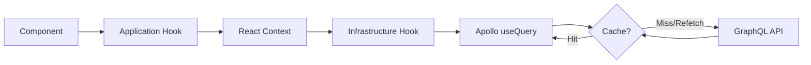
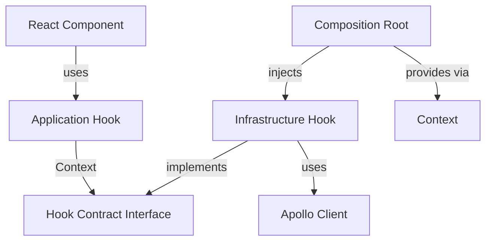

# Apollo Client - Architecture

## Purpose

This document explains why we chose **Apollo Client** as our GraphQL state management solution and how it integrates with the project's Clean Architecture.

## Why Apollo Client?

### 1. GraphQL Native

The project uses **GraphQL end-to-end** (NestJS GraphQL API + codegen). Apollo Client is the most mature and complete solution for GraphQL in the React ecosystem.

### 2. Normalized Cache

Apollo maintains a **normalized cache** that:

- Stores each entity only once (by `id` and `__typename`)
- Automatically updates all queries using that entity
- Avoids data duplication in memory

**Example:**

```typescript
// Query 1: task list
{ tasks { id, title } }

// Query 2: task detail
{ task(id: "1") { id, title, completed } }

// Both share the same object in cache!
```

### 3. Dedupe and Background Refetch

- **Dedupe**: multiple components calling the same query simultaneously → only 1 request
- **Background refetch**: shows cached data immediately, updates in background

### 4. Configurable Fetch Policies

Apollo offers fine-grained control over when to fetch data:

| Policy              | Behavior                                         |
| ------------------- | ------------------------------------------------ |
| `cache-first`       | Uses cache if available, only fetches if missing |
| `cache-and-network` | Returns cache immediately + fetches update       |
| `network-only`      | Always fetches from network, ignores cache       |
| `no-cache`          | Doesn't use cache (useful for sensitive data)    |

**In this project, we use `cache-and-network` by default** for better UX.

## How It Works in the Project

### 1. Configuration (Composition Root)

```typescript
// apps/web/src/infrastructure/graphql/apollo-client.ts
import { ApolloClient, InMemoryCache, HttpLink } from '@apollo/client';
import { API_CONFIG } from '@repo/config/env';

export const apolloClient = new ApolloClient({
  link: new HttpLink({ uri: API_CONFIG.graphqlEndpoint }),
  cache: new InMemoryCache(),
});
```

### 2. Provider (App Root)

```typescript
// apps/web/app/providers.tsx
<ApolloProvider client={apolloClient}>
  <UseCasesProvider>
    {children}
  </UseCasesProvider>
</ApolloProvider>
```

### 3. Hooks in Application Layer (Context-Based DI)

The application layer uses **Context-based Dependency Injection** to remain infrastructure-agnostic:

```typescript
// packages/application/src/features/tasks/hooks/use-get-tasks.ts
import { createContext, useContext } from 'react';
import { TasksQueryInterface, TasksQueryResult } from '@repo/domain';

const TasksQueryContext = createContext<TasksQueryInterface | null>(null);

export const TasksQueryProvider = TasksQueryContext.Provider;

export function useGetTasks(): TasksQueryResult {
  const query = useContext(TasksQueryContext);
  if (!query) {
    throw new Error('useGetTasks must be used within TasksQueryProvider');
  }
  return query();
}
```

The actual Apollo implementation lives in the **infrastructure layer**:

```typescript
// packages/infrastructure/src/features/tasks/hooks/use-apollo-tasks-query.ts
import { useQuery } from '@apollo/client';
import { GetTasksDocument } from '@repo/graphql';
import { TasksQueryResult } from '@repo/domain';
import { TaskMapper } from '../mappers';

export function useApolloTasksQuery(): TasksQueryResult {
  const { data, loading, error, refetch } = useQuery(GetTasksDocument, {
    fetchPolicy: 'cache-and-network',
  });

  return {
    data: data?.tasks ? TaskMapper.toDomainList(data.tasks) : null,
    isLoading: loading,
    isError: !!error,
    error: error ? new Error(error.message) : null,
    refetch: async () => {
      await refetch();
    },
  };
}
```

And wired up in the **Composition Root**:

```typescript
// apps/web/src/providers/UseCasesProvider.tsx
import { useApolloTasksQuery } from '@repo/infrastructure';
import { TasksQueryProvider } from '@repo/application';

<TasksQueryProvider value={useApolloTasksQuery}>
  {children}
</TasksQueryProvider>
```

### 4. Usage in UI

```typescript
// apps/web/app/page.tsx
const { data: tasks, isLoading } = useGetTasks();
```

## Data Flow



## Hook Architecture Pattern

This project uses a **two-layer hook architecture** to maintain Clean Architecture principles:



### Benefits

1. **Application layer stays pure** - No Apollo imports in application code
2. **Easy testing** - Mock the contract interface instead of Apollo
3. **Swappable implementations** - Change to REST/local storage without touching application
4. **Explicit dependencies** - Clear what's injected where

### Example Flow

1. Domain defines contract: `TasksQueryInterface`
2. Infrastructure creates Apollo hook: `useApolloTasksQuery`
3. Application exposes via Context: `TasksQueryProvider`
4. Composition Root wires them: `<TasksQueryProvider value={useApolloTasksQuery}>`
5. Components use application hook: `useGetTasks()`

## Integration with Clean Architecture

Apollo Client **does not violate** Clean Architecture when used correctly:

- **Domain**: Defines hook contracts (interfaces), doesn't know about Apollo
- **Application**: Hooks use Context-based DI, expose generic interface (`{ data, isLoading, error }`)
- **Infrastructure**: Implements contracts using Apollo Client (useQuery, useMutation)
- **Presentation**: Consumes application hooks, doesn't know it's Apollo underneath

## When NOT to Use Apollo

Consider alternatives if:

- You don't use GraphQL (use React Query + fetch/axios)
- You want total control over cache (implement custom)
- You have very specific offline sync requirements

## Common Mistakes

### ❌ Using Apollo directly in Application Layer

```typescript
// Bad: Apollo import in application layer violates Clean Architecture
// packages/application/src/hooks/use-get-tasks.ts
import { useQuery } from '@apollo/client'; // ❌ NEVER do this!
import { GetTasksDocument } from '@repo/graphql';

export function useGetTasks() {
  const { data } = useQuery(GetTasksDocument);
  // ...
}
```

### ✅ Use Context-based DI pattern

```typescript
// Good: Application hook depends only on contract
// packages/application/src/features/tasks/hooks/use-get-tasks.ts
import { createContext, useContext } from 'react';
import { TasksQueryInterface } from '@repo/domain';

const TasksQueryContext = createContext<TasksQueryInterface | null>(null);
export const TasksQueryProvider = TasksQueryContext.Provider;

export function useGetTasks() {
  const query = useContext(TasksQueryContext);
  if (!query) throw new Error('Must be within TasksQueryProvider');
  return query();
}
```

### ❌ Using `useQuery` directly in UI components

```typescript
// Bad: fetch logic in UI
function TaskList() {
  const { data } = useQuery(GetTasksDocument);
  // ...
}
```

### ✅ Encapsulate in application hook

```typescript
// Good: reusable hook from application layer
const { data } = useGetTasks();
```

### ❌ Not validating GraphQL data

```typescript
// Bad: blindly trust generated type
const tasks = data?.tasks; // may have null/undefined fields
```

### ✅ Validate with Zod in mappers

```typescript
// Good: validate with domain schema in infrastructure layer
// packages/infrastructure/src/features/tasks/mappers/task.mapper.ts
export const TaskMapper = {
  toDomain(raw: unknown): Task {
    return TaskSchema.parse(raw);
  },
  toDomainList(rawList: unknown[]): Task[] {
    return rawList.map((raw) => TaskSchema.parse(raw));
  },
};
```

## Links

- Apollo Client Docs: https://www.apollographql.com/docs/react/
- Caching: https://www.apollographql.com/docs/react/caching/overview/
- Fetch Policies: https://www.apollographql.com/docs/react/data/queries/#setting-a-fetch-policy
- Apollo DevTools: https://www.apollographql.com/docs/react/development-testing/developer-tooling/
