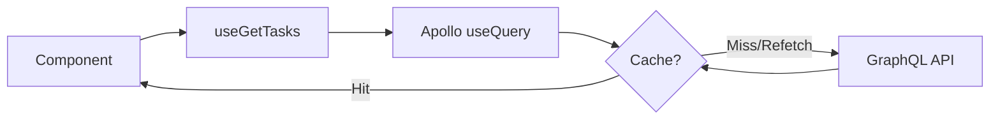

# Apollo Client - Arquitetura

## Propósito

Este documento explica por que escolhemos **Apollo Client** como solução de gerenciamento de estado para GraphQL e como ele se integra à arquitetura Clean do projeto.

## Por Que Apollo Client?

### 1. GraphQL Nativo

O projeto usa **GraphQL end-to-end** (NestJS GraphQL API + codegen). Apollo Client é a solução mais madura e completa para GraphQL no ecossistema React.

### 2. Cache Normalizado

Apollo mantém um **cache normalizado** que:

- Armazena cada entidade uma única vez (por `id` e `__typename`)
- Atualiza automaticamente todas as queries que usam aquela entidade
- Evita duplicação de dados na memória

**Exemplo:**

```typescript
// Query 1: lista de tasks
{ tasks { id, title } }

// Query 2: detalhe de uma task
{ task(id: "1") { id, title, completed } }

// Ambas compartilham o mesmo objeto no cache!
```

### 3. Dedupe e Background Refetch

- **Dedupe**: múltiplos componentes chamando a mesma query ao mesmo tempo → apenas 1 request
- **Background refetch**: mostra dados do cache imediatamente, atualiza em segundo plano

### 4. Políticas de Fetch Configuráveis

Apollo oferece controle fino sobre quando buscar dados:

| Política            | Comportamento                                   |
| ------------------- | ----------------------------------------------- |
| `cache-first`       | Usa cache se disponível, só busca se não tiver  |
| `cache-and-network` | Retorna cache imediatamente + busca atualização |
| `network-only`      | Sempre busca da rede, ignora cache              |
| `no-cache`          | Não usa cache (útil para dados sensíveis)       |

**No projeto, usamos `cache-and-network` por padrão** para melhor UX.

## Como Funciona no Projeto

### 1. Configuração (Composition Root)

```typescript
// apps/web/src/infrastructure/graphql/apollo-client.ts
import { ApolloClient, InMemoryCache, HttpLink } from '@apollo/client';
import { API_CONFIG } from '@repo/config/env';

export const apolloClient = new ApolloClient({
  link: new HttpLink({ uri: API_CONFIG.graphqlEndpoint }),
  cache: new InMemoryCache(),
});
```

### 2. Provider (App Root)

```typescript
// apps/web/app/providers.tsx
<ApolloProvider client={apolloClient}>
  <UseCasesProvider>
    {children}
  </UseCasesProvider>
</ApolloProvider>
```

### 3. Hooks na Camada de Aplicação

```typescript
// packages/application/src/hooks/use-get-tasks.ts
import { useQuery } from '@apollo/client';
import { GetTasksDocument } from '@repo/graphql';

export function useGetTasks() {
  const { data, loading, error, refetch } = useQuery(GetTasksDocument, {
    fetchPolicy: 'cache-and-network',
  });

  return { data, isLoading: loading, isError: !!error, error, refetch };
}
```

### 4. Uso na UI

```typescript
// apps/web/app/page.tsx
const { data: tasks, isLoading } = useGetTasks();
```

## Fluxo de Dados



## Integração com Clean Architecture

Apollo Client **não viola** Clean Architecture:

- **Domain**: não sabe de Apollo (só entidades Zod + interfaces)
- **Application**: hooks usam Apollo, mas expõem interface genérica (`{ data, isLoading, error }`)
- **Infrastructure**: repositórios podem usar Apollo internamente (via `client.query`)
- **Presentation**: consome hooks, não sabe que é Apollo por trás

## Quando NÃO Usar Apollo

Considere alternativas se:

- Você não usa GraphQL (use React Query + fetch/axios)
- Você quer controle total sobre cache (implemente custom)
- Você tem requisitos muito específicos de sincronização offline

## Erros Comuns

### ❌ Usar `useQuery` diretamente na UI

```typescript
// Ruim: lógica de fetch na UI
function TaskList() {
  const { data } = useQuery(GetTasksDocument);
  // ...
}
```

### ✅ Encapsular em hook de aplicação

```typescript
// Bom: hook reutilizável na camada de aplicação
const { data } = useGetTasks();
```

### ❌ Não validar dados do GraphQL

```typescript
// Ruim: confiar cegamente no tipo gerado
const tasks = data?.tasks; // pode ter campos null/undefined
```

### ✅ Validar com Zod

```typescript
// Bom: validar com schema do domain
const tasks = data?.tasks?.map((t) => TaskSchema.parse(t));
```

## Links

- Apollo Client Docs: https://www.apollographql.com/docs/react/
- Caching: https://www.apollographql.com/docs/react/caching/overview/
- Fetch Policies: https://www.apollographql.com/docs/react/data/queries/#setting-a-fetch-policy
- Apollo DevTools: https://www.apollographql.com/docs/react/development-testing/developer-tooling/
