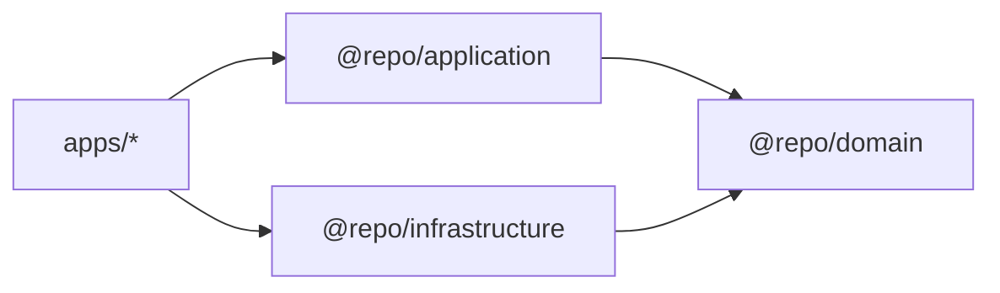
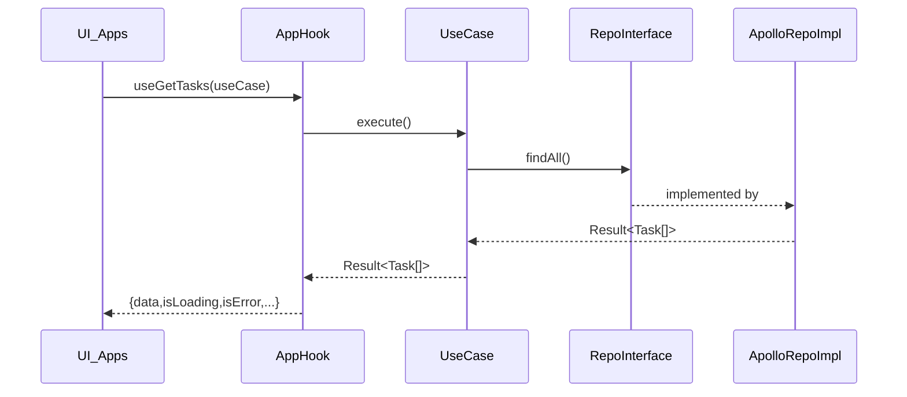

# Dependency Flow (EN)

## Purpose

Show the **direction of dependencies**, the **runtime wiring** (composition root), and how data flows through the layers.

## When to use

- You are creating a new feature and want to ensure imports and wiring are correct.
- You are unsure where mapping/validation should happen.

## Dependency direction (compile-time)

## Runtime flow (example: GetTasks)

## Where to put mapping and validation

- **Domain**: owns invariants (Zod schema). Domain does _not_ fetch.
- **Infrastructure**: converts external data (GraphQL) into domain entities using Zod.
- **Application**: applies business rules (filtering, policies, orchestration) and returns Result.

## Common mistakes

- Mapping GraphQL → domain in UI.
- Throwing exceptions for expected business failures instead of returning Result.
- Letting infrastructure import application code (wrong direction).
