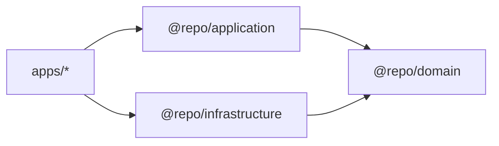
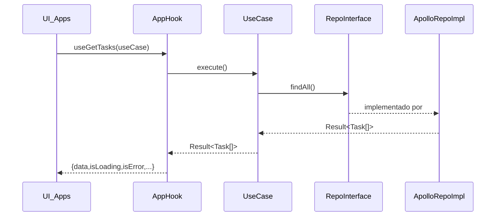

# Fluxo de Dependencias (PT)

## Proposito

Mostrar a **direcao das dependencias**, o **wiring em runtime** (composition root) e como os dados atravessam as camadas.

## Quando usar

- Voce esta criando uma feature e quer garantir imports e wiring corretos.
- Voce nao sabe onde deve acontecer mapping/validacao.

## Direcao de dependencias (compile-time)

## Fluxo em runtime (exemplo: GetTasks)

## Onde colocar mapping e validacao

- **Domain**: define invariantes (schema Zod). Domain nao busca dados.
- **Infrastructure**: converte dado externo (GraphQL) em entidade de dominio via Zod.
- **Application**: aplica regras de negocio (filtros, politicas, orquestracao) e retorna Result.

## Erros comuns

- Mapear GraphQL → dominio na UI.
- Usar exceptions para falhas esperadas em vez de Result.
- Infrastructure importar Application (direcao errada).
