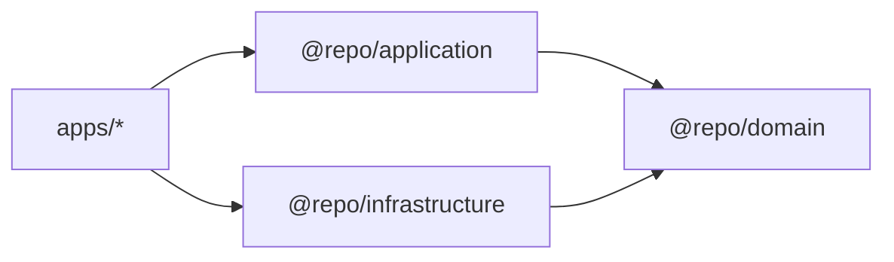

# Layers (EN)

## Purpose

Define the responsibilities, allowed dependencies, and boundaries of each layer/package.

## When to use

Use this page whenever you are unsure where a file should live or what a module is allowed to import.

## Layer responsibilities

### `@repo/domain`

- **Owns**: business entities (Zod schemas + types), repository interfaces (contracts), shared primitives (Result type).
- **Structure**:
  - `features/<feature>/entities/` - Feature entities
  - `features/<feature>/repositories/` - Repository interfaces
  - `features/<feature>/contracts/` - Hook contracts
  - `shared/core/` - Result pattern
  - `shared/errors/` - Domain errors
- **Must not**: import from React, Apollo, GraphQL, or any app.

### `@repo/application`

- **Owns**: pure use-cases (classes) and shared hooks that orchestrate use-cases.
- **Structure**:
  - `features/<feature>/use-cases/` - Use cases
  - `features/<feature>/hooks/` - React hooks with DI
  - `features/<feature>/factories/` - Use case factories
  - `shared/hooks/` - Cross-feature hooks
- **Must not**: know how data is fetched (Apollo specifics), only talk to domain interfaces.

### `@repo/infrastructure`

- **Owns**: concrete adapters (e.g., Apollo repositories), mappers, IO concerns.
- **Structure**:
  - `features/<feature>/repositories/` - Repository implementations
  - `features/<feature>/mappers/` - Data mappers
  - `features/<feature>/hooks/` - Apollo hooks
  - `shared/graphql/` - Apollo client config
- **Implements**: interfaces defined in `@repo/domain`.

### `apps/web`

- **Owns**: UI rendering + composition root (wiring dependencies).
- **Must not**: contain business rules; only coordinate DI and render state.

## Dependency rules (hard)



- `@repo/domain` imports **nothing** (except Zod).
- `@repo/application` imports **only** `@repo/domain` (and React types/hooks if needed).
- `@repo/infrastructure` imports `@repo/domain` and tech libs (Apollo, etc.).
- `apps/*` import `@repo/application`, `@repo/infrastructure`, and UI packages.

## File placement examples (Feature-Based)

| Type             | Location                                                                            |
| ---------------- | ----------------------------------------------------------------------------------- |
| Domain entity    | `packages/domain/src/features/tasks/entities/task.ts`                               |
| Domain contract  | `packages/domain/src/features/tasks/repositories/task-repository.interface.ts`      |
| Use case         | `packages/application/src/features/tasks/use-cases/get-tasks.use-case.ts`           |
| Application hook | `packages/application/src/features/tasks/hooks/use-get-tasks.ts`                    |
| Factory          | `packages/application/src/features/tasks/factories/use-cases.factory.ts`            |
| Infra repository | `packages/infrastructure/src/features/tasks/repositories/apollo-task-repository.ts` |
| Mapper           | `packages/infrastructure/src/features/tasks/mappers/task.mapper.ts`                 |
| UI component     | `apps/web/src/components/TaskList.tsx`                                              |

## Public API Pattern

Each feature exposes a controlled public API via `index.ts`:

```typescript
// packages/domain/src/features/tasks/index.ts
export { Task, TaskSchema } from './entities';
export type { TaskRepositoryInterface } from './repositories';
```

Import from the public API, not internal paths:

```typescript
// ✅ Good
import { Task } from '@repo/domain';

// ❌ Bad
import { Task } from '@repo/domain/features/tasks/entities/task';
```

## Common mistakes

- Putting Apollo queries in `@repo/application` or `apps/*`.
- Returning raw GraphQL types all the way to UI (no mapping to domain entities).
- Making use cases depend on concrete repositories instead of interfaces.
- Importing from internal paths instead of public API.

## Links

- [Feature-Based Architecture](./feature-based.en.md)
- [Public API Pattern](../patterns/public-api.en.md)
