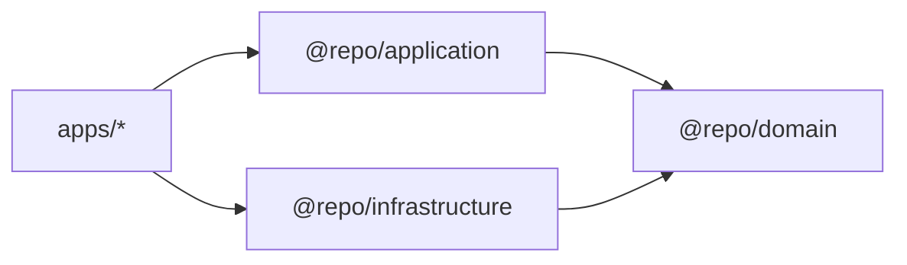

# Layers (EN)

## Purpose

Define the responsibilities, allowed dependencies, and boundaries of each layer/package.

## When to use

Use this page whenever you are unsure where a file should live or what a module is allowed to import.

## Layer responsibilities

### `@repo/domain`

- **Owns**: business entities (Zod schemas + types), repository interfaces (contracts), shared primitives (Result type).
- **Must not**: import from React, Apollo, GraphQL, or any app.

### `@repo/application`

- **Owns**: pure use-cases (classes) and shared hooks that orchestrate use-cases.
- **Must not**: know how data is fetched (Apollo specifics), only talk to domain interfaces.

### `@repo/infrastructure`

- **Owns**: concrete adapters (e.g., Apollo repositories), mappers, IO concerns.
- **Implements**: interfaces defined in `@repo/domain`.

### `apps/web` and `apps/mobile`

- **Owns**: UI rendering + composition root (wiring dependencies).
- **Must not**: contain business rules; only coordinate DI and render state.

## Dependency rules (hard)

- `@repo/domain` imports **nothing** (except Zod).
- `@repo/application` imports **only** `@repo/domain` (and React types/hooks if needed).
- `@repo/infrastructure` imports `@repo/domain` and tech libs (Apollo, etc.).
- `apps/*` import `@repo/application`, `@repo/infrastructure`, and UI packages.

## Minimal example (file placement)

- Domain entity: `packages/domain/src/entities/task.ts`
- Domain contract: `packages/domain/src/repositories/task-repository.interface.ts`
- Use case: `packages/application/src/use-cases/get-tasks.use-case.ts`
- Infra repository: `packages/infrastructure/src/repositories/apollo-task-repository.ts`
- UI usage: `apps/mobile/src/screens/TasksScreen.tsx`

## Common mistakes

- Putting Apollo queries in `@repo/application` or `apps/*`.
- Returning raw GraphQL types all the way to UI (no mapping to domain entities).
- Making use cases depend on concrete repositories instead of interfaces.
