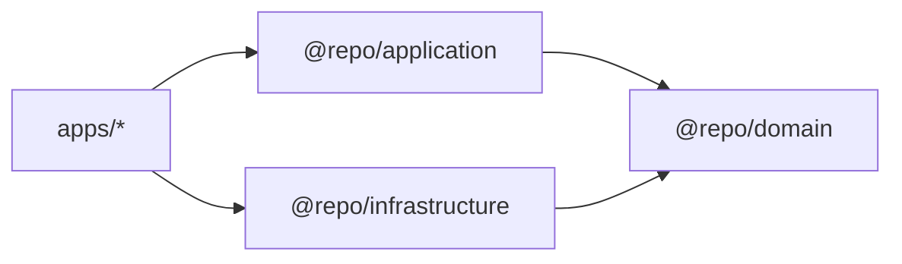

# Camadas (PT)

## Proposito

Definir responsabilidades, dependencias permitidas e boundaries de cada camada/pacote.

## Quando usar

Use esta pagina sempre que tiver duvida onde um arquivo deve ficar ou o que um modulo pode importar.

## Responsabilidades por camada

### `@repo/domain`

- **Responsavel por**: entidades (schemas Zod + types), interfaces de repositorio (contratos), primitivas (Result).
- **Nao pode**: importar React, Apollo, GraphQL, nem nada de `apps/*`.

### `@repo/application`

- **Responsavel por**: use cases (classes puras) e hooks compartilhados que orquestram use cases.
- **Nao pode**: saber detalhes de como os dados sao buscados (Apollo), apenas falar com interfaces do dominio.

### `@repo/infrastructure`

- **Responsavel por**: adapters concretos (ex: repositorios Apollo), mappers, IO.
- **Implementa**: interfaces definidas no `@repo/domain`.

### `apps/web` e `apps/mobile`

- **Responsavel por**: UI + composition root (wiring de dependencias).
- **Nao pode**: conter regra de negocio; apenas DI e renderizacao de estado.

## Regras de dependencia (hard)

- `@repo/domain` nao importa nada (exceto Zod).
- `@repo/application` importa apenas `@repo/domain` (e React hooks/types se necessario).
- `@repo/infrastructure` importa `@repo/domain` e libs tecnicas (Apollo, etc.).
- `apps/*` importam `@repo/application`, `@repo/infrastructure` e pacotes de UI.

## Exemplo minimo (onde cada coisa fica)

- Entidade: `packages/domain/src/entities/task.ts`
- Contrato: `packages/domain/src/repositories/task-repository.interface.ts`
- Use case: `packages/application/src/use-cases/get-tasks.use-case.ts`
- Repo infra: `packages/infrastructure/src/repositories/apollo-task-repository.ts`
- Uso na UI: `apps/mobile/src/screens/TasksScreen.tsx`

## Erros comuns

- Colocar query Apollo em `@repo/application` ou `apps/*`.
- Passar types do GraphQL direto para UI (sem mapear para entidade de dominio).
- Use case depender de repo concreto em vez de interface.
