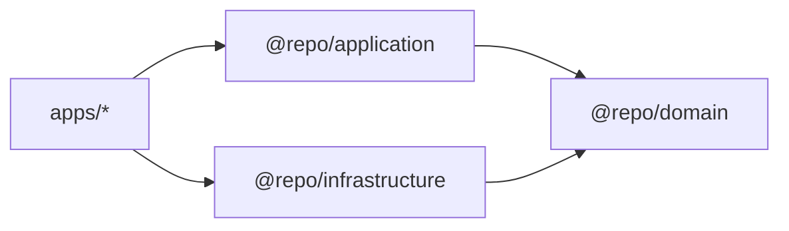

# Camadas (PT)

## Propósito

Definir as responsabilidades, dependências permitidas e limites de cada camada/pacote.

## Quando usar

Use esta página sempre que não tiver certeza de onde um arquivo deve ficar ou o que um módulo pode importar.

## Responsabilidades das camadas

### `@repo/domain`

- **Possui**: entidades de negócio (schemas Zod + tipos), interfaces de repositório (contratos), primitivas compartilhadas (tipo Result).
- **Estrutura**:
  - `features/<feature>/entities/` - Entidades da feature
  - `features/<feature>/repositories/` - Interfaces de repositório
  - `features/<feature>/contracts/` - Contratos de hooks
  - `shared/core/` - Padrão Result
  - `shared/errors/` - Erros de domínio
- **Não pode**: importar de React, Apollo, GraphQL ou qualquer app.

### `@repo/application`

- **Possui**: use-cases puros (classes) e hooks compartilhados que orquestram use-cases.
- **Estrutura**:
  - `features/<feature>/use-cases/` - Use cases
  - `features/<feature>/hooks/` - Hooks React com DI
  - `features/<feature>/factories/` - Factories de use cases
  - `shared/hooks/` - Hooks cross-feature
- **Não pode**: saber como os dados são buscados (detalhes do Apollo), apenas conversar com interfaces do domínio.

### `@repo/infrastructure`

- **Possui**: adaptadores concretos (ex: repositórios Apollo), mappers, preocupações de IO.
- **Estrutura**:
  - `features/<feature>/repositories/` - Implementações de repositório
  - `features/<feature>/mappers/` - Mapeadores de dados
  - `features/<feature>/hooks/` - Hooks Apollo
  - `shared/graphql/` - Configuração do Apollo client
- **Implementa**: interfaces definidas em `@repo/domain`.

### `apps/web`

- **Possui**: renderização de UI + composition root (conectar dependências).
- **Não pode**: conter regras de negócio; apenas coordenar DI e renderizar estado.

## Regras de dependência (rígidas)



- `@repo/domain` não importa **nada** (exceto Zod).
- `@repo/application` importa **apenas** `@repo/domain` (e tipos/hooks React se necessário).
- `@repo/infrastructure` importa `@repo/domain` e libs técnicas (Apollo, etc.).
- `apps/*` importam `@repo/application`, `@repo/infrastructure` e pacotes de UI.

## Exemplos de localização de arquivos (Feature-Based)

| Tipo                | Localização                                                                         |
| ------------------- | ----------------------------------------------------------------------------------- |
| Entidade de domínio | `packages/domain/src/features/tasks/entities/task.ts`                               |
| Contrato de domínio | `packages/domain/src/features/tasks/repositories/task-repository.interface.ts`      |
| Use case            | `packages/application/src/features/tasks/use-cases/get-tasks.use-case.ts`           |
| Hook de aplicação   | `packages/application/src/features/tasks/hooks/use-get-tasks.ts`                    |
| Factory             | `packages/application/src/features/tasks/factories/use-cases.factory.ts`            |
| Repositório infra   | `packages/infrastructure/src/features/tasks/repositories/apollo-task-repository.ts` |
| Mapper              | `packages/infrastructure/src/features/tasks/mappers/task.mapper.ts`                 |
| Componente UI       | `apps/web/src/components/TaskList.tsx`                                              |

## Padrão de API Pública

Cada feature expõe uma API pública controlada via `index.ts`:

```typescript
// packages/domain/src/features/tasks/index.ts
export { Task, TaskSchema } from './entities';
export type { TaskRepositoryInterface } from './repositories';
```

Importe da API pública, não de caminhos internos:

```typescript
// ✅ Correto
import { Task } from '@repo/domain';

// ❌ Errado
import { Task } from '@repo/domain/features/tasks/entities/task';
```

## Erros comuns

- Colocar queries Apollo em `@repo/application` ou `apps/*`.
- Retornar tipos GraphQL brutos até a UI (sem mapear para entidades de domínio).
- Fazer use cases dependerem de repositórios concretos ao invés de interfaces.
- Importar de caminhos internos ao invés da API pública.

## Links

- [Arquitetura Feature-Based](./feature-based.pt.md)
- [Padrão de API Pública](../patterns/public-api.pt.md)
