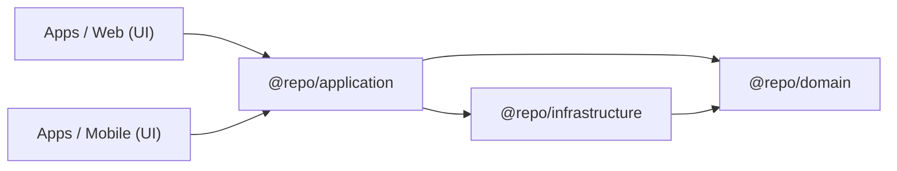

# Architecture Overview (EN)

## Purpose

Explain **what this boilerplate is optimizing for** and how the architecture is organized so Web and Mobile can share the same business logic safely.

## When to use

- You want a production-grade reference for **Clean Architecture + SOLID** in a TypeScript monorepo.
- You want **Web and Mobile** to be thin UI shells while sharing domain rules and use-cases.
- You want a codebase that scales in complexity without turning into “hooks everywhere” spaghetti.

## What this repo is

- A **Turborepo + pnpm workspaces** monorepo.
- A **GraphQL** API (`apps/api`) consumed by Web (`apps/web`) and Mobile (`apps/mobile`).
- A shared, layered architecture in `packages/`:
  - `@repo/domain`: entities + contracts + Result type
  - `@repo/application`: use cases + shared hooks that orchestrate use cases
  - `@repo/infrastructure`: concrete implementations (Apollo repositories, mappers)
  - `@repo/graphql`: generated GraphQL types/documents (codegen)
  - `@repo/ui`: shared UI primitives

## Core idea (in one sentence)

**Business rules live in shared packages; apps only render and wire dependencies (composition root).**

## Minimal mental model

## Common mistakes

- Putting business rules in React components or hooks inside `apps/*`.
- Importing Apollo/GraphQL types directly into `@repo/domain`.
- Skipping dependency injection and instantiating repositories inside use cases.

## Links

- **Clean Architecture**: `https://blog.cleancoder.com/uncle-bob/2012/08/13/the-clean-architecture.html`
- **SOLID**: `https://en.wikipedia.org/wiki/SOLID`
- **Turborepo**: `https://turborepo.com/docs`
