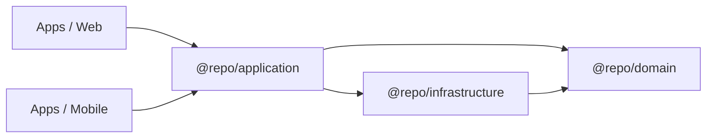

# Visao Geral da Arquitetura (PT)

## Proposito

Explicar **o que este boilerplate otimiza** e como a arquitetura foi organizada para manter separacao de concerns.

## Quando usar

- Voce quer uma referencia pronta para producao de **Clean Architecture + SOLID** em um monorepo TypeScript.
- Voce quer uma camada fina de UI, centralizando dominio e use cases em pacotes compartilhados.
- Voce quer um codigo que escale sem virar "hooks em todo lugar".

## O que existe neste repositorio

- Monorepo com **Turborepo + pnpm workspaces**.
- API GraphQL (`apps/api`) consumida por Web (`apps/web`) e Mobile (`apps/mobile`).
- Camadas compartilhadas em `packages/`:
  - `@repo/domain`: entidades + contratos + tipo Result
  - `@repo/application`: use cases + hooks compartilhados (orquestracao)
  - `@repo/infrastructure`: implementacoes concretas (repositorios Apollo, mappers)
  - `@repo/graphql`: tipos/documentos GraphQL gerados (codegen)
  - `@repo/ui`: primitivas de UI compartilhadas (somente web)

## Ideia central (uma frase)

**Regras de negocio vivem em pacotes compartilhados; apps apenas renderizam e fazem wiring (composition root).**

## Modelo mental minimo

## Erros comuns

- Colocar regra de negocio em componente React ou hook dentro de `apps/*`.
- Importar tipos do Apollo/GraphQL direto no `@repo/domain`.
- Criar repositorios dentro de use cases (sem DI / composition root).

## Links

- **Clean Architecture**: `https://blog.cleancoder.com/uncle-bob/2012/08/13/the-clean-architecture.html`
- **SOLID**: `https://en.wikipedia.org/wiki/SOLID`
- **Turborepo**: `https://turborepo.com/docs`
