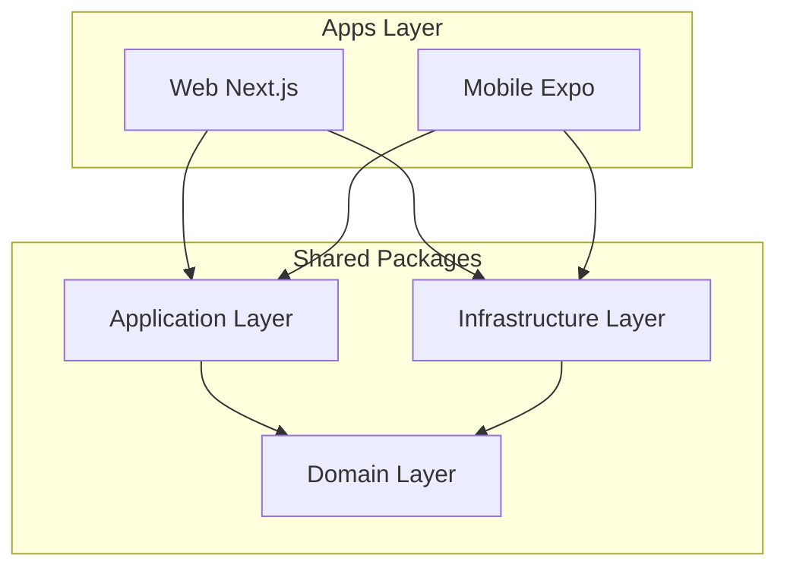
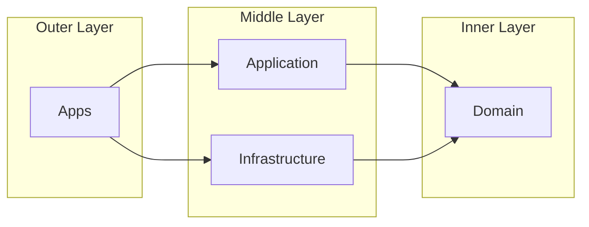
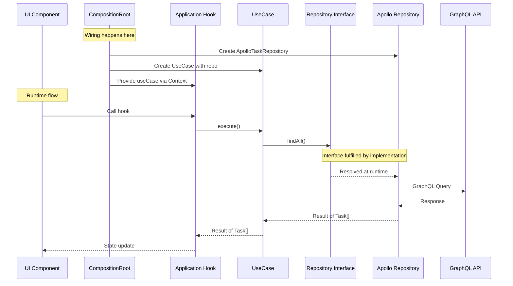

# Why Layers? A Deep Dive into Clean Architecture

## Purpose

Explain **why** this boilerplate uses a layered architecture, what problems it solves, and when (and when not) to use it. This document goes beyond "what" and "how" to address the fundamental reasoning behind architectural decisions.

## When to Read This

- You're questioning whether this complexity is worth it
- You want to understand the philosophy behind Clean Architecture
- You need to justify architectural decisions to your team
- You're evaluating whether this approach fits your project

---

## The Problem We're Solving

Before diving into solutions, let's understand the problems that layered architecture addresses.

### The Reality of "Simple" Codebases

Most projects start simple. A Next.js app with some API calls:

```typescript
// ❌ The "simple" approach that becomes complex
// app/tasks/page.tsx

'use client';

import { useQuery, useMutation } from '@apollo/client';
import { gql } from '@apollo/client';
import { useState, useEffect } from 'react';

const GET_TASKS = gql`
  query GetTasks {
    tasks {
      id
      title
      completed
      priority
      createdAt
    }
  }
`;

const CREATE_TASK = gql`
  mutation CreateTask($title: String!) {
    createTask(title: $title) {
      id
      title
      completed
    }
  }
`;

export default function TasksPage() {
  const [filter, setFilter] = useState<'all' | 'active' | 'completed'>('all');
  const { data, loading, error } = useQuery(GET_TASKS);
  const [createTask] = useMutation(CREATE_TASK, {
    refetchQueries: [{ query: GET_TASKS }],
  });

  // Business logic mixed with UI
  const filteredTasks = data?.tasks?.filter((task) => {
    if (filter === 'active') return !task.completed;
    if (filter === 'completed') return task.completed;
    return true;
  });

  // More business logic: sorting by priority
  const sortedTasks = filteredTasks?.sort((a, b) => {
    // Priority 1 is highest
    return a.priority - b.priority;
  });

  // Even more business logic: validation
  const handleCreate = async (title: string) => {
    if (title.length < 3) {
      alert('Title must be at least 3 characters');
      return;
    }
    if (title.length > 100) {
      alert('Title must be less than 100 characters');
      return;
    }
    await createTask({ variables: { title } });
  };

  // Date formatting logic
  const formatDate = (date: string) => {
    return new Date(date).toLocaleDateString('en-US', {
      month: 'short',
      day: 'numeric',
    });
  };

  if (loading) return <div>Loading...</div>;
  if (error) return <div>Error: {error.message}</div>;

  return (
    <div>
      {/* UI rendering */}
    </div>
  );
}
```

### What's Wrong With This?

At first glance, nothing. It works. But let's analyze the **hidden costs**:

#### 1. Impossible to Test Business Logic

```typescript
// How do you test the filtering logic?
// You can't. It's inside a React component.
// You need to:
// - Set up React Testing Library
// - Mock Apollo Client
// - Mock the GraphQL response
// - Render the component
// - Assert on DOM elements

// All this just to test: "does filtering work?"
```

#### 2. Duplication When Adding Mobile

```typescript
// Now you need the same logic in React Native
// app/screens/TasksScreen.tsx (mobile)

// Copy-paste everything, adapt for React Native
const filteredTasks = data?.tasks?.filter((task) => {
  // Same logic, duplicated
  if (filter === 'active') return !task.completed;
  if (filter === 'completed') return task.completed;
  return true;
});

// Same validation, duplicated
if (title.length < 3) {
  Alert.alert('Error', 'Title must be at least 3 characters');
  return;
}
```

#### 3. Tight Coupling to GraphQL

```typescript
// Your business logic knows about GraphQL structure
const sortedTasks = data?.tasks?.sort(/* ... */);
//                       ^^^^^^
// What if the API changes from `tasks` to `taskList`?
// What if you switch to REST?
// Every component needs to change.
```

#### 4. Validation Logic Scattered

```typescript
// TasksPage.tsx
if (title.length < 3) {
  /* ... */
}

// CreateTaskModal.tsx (somewhere else)
if (title.trim().length < 3) {
  /* ... */
} // Slightly different!

// EditTaskForm.tsx (another place)
if (!title || title.length < 3) {
  /* ... */
} // Another variation!

// Which one is correct? Nobody knows.
```

#### 5. Error Handling is Inconsistent

```typescript
// Component A
if (error) return <div>Error: {error.message}</div>;

// Component B
if (error) {
  console.error(error);
  return <ErrorPage />;
}

// Component C
if (error) throw error; // Let error boundary handle it

// No consistent strategy
```

### The Compound Effect

These issues compound over time:

| Time     | Lines of Code | Test Coverage | Bug Frequency | Change Cost |
| -------- | ------------- | ------------- | ------------- | ----------- |
| Month 1  | 5,000         | 20%           | Low           | Low         |
| Month 6  | 25,000        | 15%           | Medium        | Medium      |
| Month 12 | 60,000        | 10%           | High          | High        |
| Month 24 | 120,000       | 5%            | Very High     | Very High   |

The codebase becomes **progressively harder to maintain**.

---

## The Solution: Layered Architecture

Layered architecture addresses these problems by **separating concerns** into distinct layers with clear responsibilities.



---

## Why Each Layer Exists

### Domain Layer: "The Truth"

The domain layer is the **heart** of your application. It defines **what** your business is, not how it's implemented.

#### What It Contains

```typescript
// packages/domain/src/features/tasks/entities/task.ts

import { z } from 'zod';

/**
 * Task Entity
 *
 * This is the SINGLE SOURCE OF TRUTH for what a Task is.
 * Every part of the system that deals with Tasks must conform to this.
 */
export const TaskSchema = z.object({
  id: z.string().uuid(),
  title: z.string().min(3).max(100),
  description: z.string().max(500).optional(),
  completed: z.boolean().default(false),
  priority: z.number().int().min(1).max(5).default(3),
  createdAt: z.coerce.date(),
  updatedAt: z.coerce.date(),
});

export type Task = z.infer<typeof TaskSchema>;

// Derived types for specific operations
export const CreateTaskInputSchema = TaskSchema.pick({
  title: true,
  description: true,
  priority: true,
});

export type CreateTaskInput = z.infer<typeof CreateTaskInputSchema>;
```

#### Why This Matters

**1. Single Source of Truth**

Before:

```typescript
// Types defined in 5 different places
// API types, component props, form validation, database schema, tests
// All slightly different, all out of sync
```

After:

```typescript
// One place defines Task
// Everyone imports from @repo/domain
// Change once, propagate everywhere
```

**2. Validation is Declarative**

Before:

```typescript
// Validation scattered across components
if (title.length < 3) {
  /* ... */
}
if (title.length > 100) {
  /* ... */
}
if (!priority || priority < 1 || priority > 5) {
  /* ... */
}
```

After:

```typescript
// Validation defined once in schema
const result = TaskSchema.safeParse(data);
if (!result.success) {
  // Zod provides detailed error messages
  console.log(result.error.format());
}
```

**3. Framework Independence**

The domain layer has **zero framework dependencies**:

```typescript
// packages/domain/package.json
{
  "dependencies": {
    "zod": "^3.x"  // Only Zod, nothing else
  }
}
```

This means:

- Test without React, Apollo, or any framework
- Reuse in any JavaScript/TypeScript environment
- Survive framework migrations (React 18 → 19, Apollo 3 → 4)

#### Real Scenario: GraphQL Schema Changes

Your backend team changes the API:

```graphql
# Before
type Task {
  id: ID!
  title: String!
  completed: Boolean!
  createdAt: DateTime!
}

# After (breaking change!)
type Task {
  id: ID!
  title: String!
  isCompleted: Boolean! # Renamed!
  timestamps: Timestamps! # Restructured!
}

type Timestamps {
  created: DateTime!
  updated: DateTime!
}
```

**Without layers:** Change 30+ files across your codebase.

**With layers:**

```typescript
// Only change the mapper (infrastructure layer)
export const TaskMapper = {
  toDomain(raw: GraphQLTask): Task {
    return TaskSchema.parse({
      id: raw.id,
      title: raw.title,
      completed: raw.isCompleted, // Map new field name
      createdAt: raw.timestamps.created, // Map nested structure
      updatedAt: raw.timestamps.updated,
    });
  },
};

// Domain stays the same
// Application stays the same
// Components stay the same
```

**Impact:** 1 file changed instead of 30+.

---

### Application Layer: "The Orchestration"

The application layer contains **business logic** and **use cases**. It answers the question: "What can users do with our system?"

#### What It Contains

```typescript
// packages/application/src/features/tasks/use-cases/get-tasks.use-case.ts

import {
  Task,
  TaskRepositoryInterface,
  Result,
  success,
  failure,
  DomainError,
} from '@repo/domain';

export interface GetTasksFilter {
  status?: 'all' | 'active' | 'completed';
  sortBy?: 'priority' | 'createdAt';
  sortOrder?: 'asc' | 'desc';
}

/**
 * Get Tasks Use Case
 *
 * Encapsulates all business logic for retrieving tasks.
 * This is a pure class with no side effects.
 */
export class GetTasksUseCase {
  constructor(private readonly taskRepository: TaskRepositoryInterface) {}

  async execute(
    filter: GetTasksFilter = {},
  ): Promise<Result<Task[], DomainError>> {
    // 1. Fetch tasks from repository
    const result = await this.taskRepository.findAll();

    if (!result.ok) {
      return result;
    }

    let tasks = result.value;

    // 2. Apply business rules: filtering
    if (filter.status === 'active') {
      tasks = tasks.filter((t) => !t.completed);
    } else if (filter.status === 'completed') {
      tasks = tasks.filter((t) => t.completed);
    }

    // 3. Apply business rules: sorting
    const sortBy = filter.sortBy ?? 'createdAt';
    const sortOrder = filter.sortOrder ?? 'desc';

    tasks = [...tasks].sort((a, b) => {
      const aValue = a[sortBy];
      const bValue = b[sortBy];

      if (aValue < bValue) return sortOrder === 'asc' ? -1 : 1;
      if (aValue > bValue) return sortOrder === 'asc' ? 1 : -1;
      return 0;
    });

    return success(tasks);
  }
}
```

#### Why This Matters

**1. Business Logic is Explicit**

Before:

```typescript
// Where is the filtering logic?
// In TasksPage.tsx? TaskList.tsx? useGetTasks.ts?
// Nobody knows, scattered everywhere
```

After:

```typescript
// GetTasksUseCase is THE place for task retrieval logic
// It's explicit, documented, and testable
```

**2. Testable Without Frameworks**

```typescript
// packages/application/src/features/tasks/use-cases/get-tasks.use-case.test.ts

import { describe, it, expect, vi } from 'vitest';
import { GetTasksUseCase } from './get-tasks.use-case';
import { success } from '@repo/domain';

describe('GetTasksUseCase', () => {
  it('should filter active tasks only', async () => {
    // Arrange: Create a fake repository
    const mockRepo = {
      findAll: vi.fn().mockResolvedValue(
        success([
          {
            id: '1',
            title: 'Task 1',
            completed: false,
            priority: 1,
            createdAt: new Date(),
          },
          {
            id: '2',
            title: 'Task 2',
            completed: true,
            priority: 2,
            createdAt: new Date(),
          },
          {
            id: '3',
            title: 'Task 3',
            completed: false,
            priority: 3,
            createdAt: new Date(),
          },
        ]),
      ),
    };

    const useCase = new GetTasksUseCase(mockRepo);

    // Act
    const result = await useCase.execute({ status: 'active' });

    // Assert
    expect(result.ok).toBe(true);
    if (result.ok) {
      expect(result.value).toHaveLength(2);
      expect(result.value.every((t) => !t.completed)).toBe(true);
    }
  });

  it('should sort by priority ascending', async () => {
    const mockRepo = {
      findAll: vi.fn().mockResolvedValue(
        success([
          { id: '1', priority: 3, completed: false, createdAt: new Date() },
          { id: '2', priority: 1, completed: false, createdAt: new Date() },
          { id: '3', priority: 2, completed: false, createdAt: new Date() },
        ]),
      ),
    };

    const useCase = new GetTasksUseCase(mockRepo);
    const result = await useCase.execute({
      sortBy: 'priority',
      sortOrder: 'asc',
    });

    expect(result.ok).toBe(true);
    if (result.ok) {
      expect(result.value[0].priority).toBe(1);
      expect(result.value[1].priority).toBe(2);
      expect(result.value[2].priority).toBe(3);
    }
  });
});

// No React, no Apollo, no GraphQL
// Just pure logic testing
// Runs in milliseconds
```

**3. Reusable Across Platforms**

```typescript
// Web app
import { GetTasksUseCase } from '@repo/application';

// Mobile app - SAME import, SAME logic
import { GetTasksUseCase } from '@repo/application';

// CLI tool - SAME import, SAME logic
import { GetTasksUseCase } from '@repo/application';

// 100% code reuse for business logic
```

#### Real Scenario: Complex Business Rule Change

Product requirement: "Tasks with priority 1 should always appear first, regardless of other sorting."

**Without layers:**

- Find all places that sort tasks
- Modify each one
- Hope you didn't miss any
- Write integration tests for each component

**With layers:**

```typescript
// Modify one use case
export class GetTasksUseCase {
  async execute(
    filter: GetTasksFilter = {},
  ): Promise<Result<Task[], DomainError>> {
    // ... existing code ...

    // NEW: Priority 1 tasks always first
    const priority1Tasks = tasks.filter((t) => t.priority === 1);
    const otherTasks = tasks.filter((t) => t.priority !== 1);

    tasks = [...priority1Tasks, ...otherTasks];

    return success(tasks);
  }
}

// Write one unit test
it('should always show priority 1 tasks first', async () => {
  // Test the specific business rule
});

// Done. All platforms automatically get the new behavior.
```

---

### Infrastructure Layer: "The Adapter"

The infrastructure layer contains **technical implementations**. It answers: "How do we actually fetch/store data?"

#### What It Contains

```typescript
// packages/infrastructure/src/features/tasks/repositories/apollo-task-repository.ts

import { ApolloClient } from '@apollo/client';
import {
  Task,
  TaskRepositoryInterface,
  CreateTaskInput,
  Result,
  success,
  failure,
  DomainError,
  NetworkError,
} from '@repo/domain';
import { GetTasksDocument, CreateTaskDocument } from '@repo/graphql';
import { TaskMapper } from '../mappers/task.mapper';

/**
 * Apollo implementation of TaskRepository
 *
 * This is the ONLY place that knows about GraphQL.
 * The rest of the application is GraphQL-agnostic.
 */
export class ApolloTaskRepository implements TaskRepositoryInterface {
  constructor(private readonly client: ApolloClient<unknown>) {}

  async findAll(): Promise<Result<Task[], DomainError>> {
    try {
      const { data } = await this.client.query({
        query: GetTasksDocument,
        fetchPolicy: 'network-only',
      });

      if (!data?.tasks) {
        return success([]);
      }

      // Map GraphQL response to domain entities
      const tasks = TaskMapper.toDomainList(data.tasks);
      return success(tasks);
    } catch (error) {
      return failure(new NetworkError('Failed to fetch tasks', error));
    }
  }

  async create(input: CreateTaskInput): Promise<Result<Task, DomainError>> {
    try {
      const { data } = await this.client.mutate({
        mutation: CreateTaskDocument,
        variables: input,
      });

      if (!data?.createTask) {
        return failure(new NetworkError('Failed to create task'));
      }

      const task = TaskMapper.toDomain(data.createTask);
      return success(task);
    } catch (error) {
      return failure(new NetworkError('Failed to create task', error));
    }
  }
}
```

#### Why This Matters

**1. Technology is Swappable**

Want to switch from Apollo to React Query? Or from GraphQL to REST?

```typescript
// Option 1: Apollo Client
export class ApolloTaskRepository implements TaskRepositoryInterface {
  /* ... */
}

// Option 2: React Query
export class ReactQueryTaskRepository implements TaskRepositoryInterface {
  /* ... */
}

// Option 3: REST API
export class RestTaskRepository implements TaskRepositoryInterface {
  async findAll(): Promise<Result<Task[], DomainError>> {
    const response = await fetch('/api/tasks');
    const data = await response.json();
    return success(TaskMapper.toDomainList(data));
  }
}

// Option 4: Local storage (for offline-first)
export class LocalStorageTaskRepository implements TaskRepositoryInterface {
  async findAll(): Promise<Result<Task[], DomainError>> {
    const data = JSON.parse(localStorage.getItem('tasks') || '[]');
    return success(TaskMapper.toDomainList(data));
  }
}

// The interface stays the same
// Application layer doesn't change
// Just swap the implementation in composition root
```

**2. Mappers Protect the Boundary**

```typescript
// packages/infrastructure/src/features/tasks/mappers/task.mapper.ts

import { Task, TaskSchema } from '@repo/domain';

/**
 * Task Mapper
 *
 * Converts external data formats to domain entities.
 * This is where external changes are absorbed.
 */
export const TaskMapper = {
  /**
   * Converts raw API data to a validated Task entity
   *
   * If the API structure changes, update THIS function.
   * Everything else stays the same.
   */
  toDomain(raw: unknown): Task {
    // Zod validates and transforms
    return TaskSchema.parse(raw);
  },

  toDomainList(rawList: unknown[]): Task[] {
    return rawList.map((raw) => TaskSchema.parse(raw));
  },

  /**
   * Converts domain entity to API format (for mutations)
   */
  toApi(task: Task): Record<string, unknown> {
    return {
      id: task.id,
      title: task.title,
      description: task.description ?? null,
      completed: task.completed,
      priority: task.priority,
    };
  },
};
```

**3. Caching and Optimization are Isolated**

```typescript
// Adding caching doesn't affect application logic
export class CachedTaskRepository implements TaskRepositoryInterface {
  constructor(
    private readonly baseRepo: TaskRepositoryInterface,
    private readonly cache: CacheService,
  ) {}

  async findAll(): Promise<Result<Task[], DomainError>> {
    // Check cache first
    const cached = await this.cache.get<Task[]>('tasks');
    if (cached) {
      return success(cached);
    }

    // Fallback to base repository
    const result = await this.baseRepo.findAll();

    if (result.ok) {
      await this.cache.set('tasks', result.value, { ttl: 60 });
    }

    return result;
  }
}

// Use it transparently
const repo = new CachedTaskRepository(
  new ApolloTaskRepository(client),
  new RedisCache(),
);
```

#### Real Scenario: Migrating from GraphQL to REST

Your company decides to migrate from GraphQL to REST API.

**Without layers:**

- Find every `useQuery` and `useMutation` call
- Rewrite to `fetch` or `axios`
- Update data transformation in 50+ places
- Pray nothing breaks

**With layers:**

```typescript
// Step 1: Create new repository
export class RestTaskRepository implements TaskRepositoryInterface {
  async findAll(): Promise<Result<Task[], DomainError>> {
    const response = await fetch('/api/v2/tasks');
    const data = await response.json();
    return success(TaskMapper.toDomainList(data.items));
  }
}

// Step 2: Update composition root
// apps/web/src/providers/UseCasesProvider.tsx

// Before
const taskRepo = new ApolloTaskRepository(apolloClient);

// After
const taskRepo = new RestTaskRepository();

// Step 3: Done. Everything else works automatically.
```

**Impact:** 2-3 files changed. 0 components touched.

---

## Real-World Evolution Scenarios

### Scenario 1: Adding a Mobile App

**Day 1:** Web app only
**Day 100:** Need iOS and Android apps

**Without layers:**

```
Files to write for mobile:
├── screens/TasksScreen.tsx (copy from web, adapt)
├── screens/CreateTaskScreen.tsx (copy from web, adapt)
├── hooks/useGetTasks.ts (copy, adapt Apollo for React Native)
├── hooks/useCreateTask.ts (copy, adapt)
├── utils/taskFiltering.ts (copy, realize web has bugs, fix both)
├── utils/taskSorting.ts (copy, different implementation somehow)
├── types/task.ts (copy, now you have 2 sources of truth)
└── ... 20 more files
```

Total: **~3,000 lines of duplicated/adapted code**

**With layers:**

```
Files to write for mobile:
├── screens/TasksScreen.tsx (UI only, uses shared hooks)
├── screens/CreateTaskScreen.tsx (UI only)
├── providers/AppProviders.tsx (wire shared packages)
└── ... 5 more UI files
```

Shared automatically:

- Domain entities and validation
- All use cases and business logic
- Repository implementations
- Mappers and error handling

Total: **~500 lines of new code** (UI only)

**Code reuse: 80-90%**

### Scenario 2: Backend Breaking Change

API team refactors the task endpoint:

```graphql
# Before
query GetTasks {
  tasks {
    id
    title
    completed
  }
}

# After
query GetTasks {
  taskConnection {
    edges {
      node {
        taskId
        taskTitle
        status
      }
    }
    pageInfo {
      hasNextPage
    }
  }
}
```

**Without layers:**

| File                       | Changes Needed              |
| -------------------------- | --------------------------- |
| hooks/useGetTasks.ts       | Update query, destructuring |
| components/TaskList.tsx    | Update property access      |
| components/TaskItem.tsx    | Update property access      |
| components/TaskFilters.tsx | Update filter logic         |
| pages/tasks/[id].tsx       | Update individual task      |
| utils/taskHelpers.ts       | Update type references      |
| tests/\*.test.tsx          | Update mocks and assertions |
| **Total**                  | **15-20 files**             |

**With layers:**

| File                                  | Changes Needed         |
| ------------------------------------- | ---------------------- |
| graphql/queries/tasks.graphql         | Update query structure |
| infrastructure/mappers/task.mapper.ts | Update field mapping   |
| **Total**                             | **2 files**            |

### Scenario 3: Adding Complex Business Logic

New requirement: "Premium users can have unlimited tasks, free users are limited to 10."

**Without layers:**

```typescript
// Where to put this logic?

// Option A: In the component (bad)
function TasksPage() {
  const { user } = useAuth();
  const { data: tasks } = useGetTasks();

  if (!user.isPremium && tasks.length >= 10) {
    // Block creation... but CreateTaskModal also needs this check
    // And the mobile app too
  }
}

// Option B: In the hook (slightly better, still duplicated across apps)
function useGetTasks() {
  // Premium logic here
  // But duplicated in useCreateTask too
}
```

**With layers:**

```typescript
// packages/application/src/features/tasks/use-cases/create-task.use-case.ts

export class CreateTaskUseCase {
  constructor(
    private readonly taskRepo: TaskRepositoryInterface,
    private readonly userRepo: UserRepositoryInterface,
  ) {}

  async execute(input: CreateTaskInput): Promise<Result<Task, DomainError>> {
    // Business rule: Free users limited to 10 tasks
    const userResult = await this.userRepo.getCurrentUser();
    if (!userResult.ok) return userResult;

    const user = userResult.value;

    if (!user.isPremium) {
      const tasksResult = await this.taskRepo.findAll();
      if (tasksResult.ok && tasksResult.value.length >= 10) {
        return failure(
          new BusinessError(
            'FREE_TIER_LIMIT',
            'Free users can only have 10 tasks. Upgrade to premium for unlimited tasks.',
          ),
        );
      }
    }

    return this.taskRepo.create(input);
  }
}

// ONE place for the rule
// Automatically enforced in web, mobile, API
// Easy to test
// Easy to modify
```

---

## Dependency Flow: A Deep Dive

### Compile-Time Dependencies



**Key Rule:** Dependencies point inward. Inner layers never import from outer layers.

### Why Inner Layers Don't Import Outer

```typescript
// ❌ WRONG: Domain importing from Infrastructure
// packages/domain/src/features/tasks/entities/task.ts

import { ApolloTaskRepository } from '@repo/infrastructure'; // VIOLATION!

// This would mean:
// - Domain can't exist without infrastructure
// - Can't test domain without Apollo
// - Domain changes when infrastructure changes
```

```typescript
// ✅ CORRECT: Domain defines interfaces
// packages/domain/src/features/tasks/repositories/task-repository.interface.ts

export interface TaskRepositoryInterface {
  findAll(): Promise<Result<Task[], DomainError>>;
  create(input: CreateTaskInput): Promise<Result<Task, DomainError>>;
}

// Infrastructure implements the interface
// packages/infrastructure/src/features/tasks/repositories/apollo-task-repository.ts

export class ApolloTaskRepository implements TaskRepositoryInterface {
  // Implementation details here
}
```

### Dependency Inversion in Action



---

## Trade-offs: Brutally Honest

### Advantages

| Benefit                    | Impact | Measurement                                          |
| -------------------------- | ------ | ---------------------------------------------------- |
| **Testability**            | High   | Unit test coverage can reach 90%+ for business logic |
| **Reusability**            | High   | 80-90% code sharing between web and mobile           |
| **Maintainability**        | High   | Bug fixes in one place, propagate everywhere         |
| **Team Scalability**       | High   | Teams can work on different layers without conflicts |
| **Framework Independence** | Medium | Domain and Application can outlive React             |
| **Onboarding**             | Medium | Clear structure aids understanding (once learned)    |

### Disadvantages

| Drawback                     | Impact | Mitigation                        |
| ---------------------------- | ------ | --------------------------------- |
| **Initial Complexity**       | High   | Use generators, follow templates  |
| **More Files**               | Medium | Good IDE navigation, clear naming |
| **Boilerplate**              | Medium | Code generators, snippets         |
| **Learning Curve**           | High   | Documentation, examples           |
| **Overkill for Simple Apps** | High   | Don't use for landing pages       |

### When to Use This Architecture

**Use it when:**

- Building for multiple platforms (web + mobile)
- Complex business logic (not just CRUD)
- Team size > 3 developers
- Project lifespan > 6 months
- High test coverage required
- Enterprise or financial applications
- Regulatory compliance needed

**Don't use it when:**

- Marketing/landing pages
- Simple CRUD with < 5 entities
- MVPs with < 1 month timeline
- Solo developer prototypes
- One-off internal tools
- Static sites

### The Complexity Budget

Think of architectural complexity as a budget:

```
Project Complexity Score:
┌────────────────────────────────────────────────────────┐
│ Simple CRUD          │ ████░░░░░░░░░░░░░░░░ 20%       │
│ + Multiple platforms │ ████████░░░░░░░░░░░░ 40%       │
│ + Complex business   │ ████████████░░░░░░░░ 60%       │
│ + Regulatory         │ ████████████████░░░░ 80%       │
│ + Multiple teams     │ ████████████████████ 100%      │
└────────────────────────────────────────────────────────┘

If your project is < 40%, simpler architecture might suffice.
If your project is > 60%, layered architecture pays dividends.
```

---

## Comparison with Alternatives

### Traditional MVC

```
┌─────────────────────────────────────────────────────────┐
│ MVC                          │ Layered Architecture    │
├─────────────────────────────────────────────────────────┤
│ View-Controller-Model        │ UI-App-Domain-Infra     │
│ Often conflates UI/business  │ Strict separation       │
│ Model often = database shape │ Domain = business shape │
│ Good for server-rendered     │ Good for SPAs, mobile   │
└─────────────────────────────────────────────────────────┘
```

### Feature Folders (No Layers)

```
┌─────────────────────────────────────────────────────────┐
│ Feature Folders              │ Layered + Feature-Based │
├─────────────────────────────────────────────────────────┤
│ All code in one folder       │ Features split by layer │
│ Simple navigation            │ Clear responsibilities  │
│ Can become internally messy  │ Each slice is clean     │
│ Good for small-medium apps   │ Good for complex apps   │
└─────────────────────────────────────────────────────────┘
```

### Monolithic Next.js

```
┌─────────────────────────────────────────────────────────┐
│ Monolithic Next.js           │ Layered Architecture    │
├─────────────────────────────────────────────────────────┤
│ Fast to start                │ Slower initial setup    │
│ Components do everything     │ Clear separation        │
│ Hard to share with mobile    │ Easy sharing            │
│ Testing requires React       │ Pure logic testing      │
│ Good for prototypes          │ Good for production     │
└─────────────────────────────────────────────────────────┘
```

---

## Common Misconceptions

### "It's Over-Engineering"

**Reality:** It's **appropriate engineering** for complex systems.

A 5-story building doesn't need the same foundation as a skyscraper. But if you're building a skyscraper on a house foundation, that's **under-engineering**.

The question isn't "is this complex?" but "does my project warrant this complexity?"

### "Too Much Boilerplate"

**Reality:** Boilerplate has ROI.

```typescript
// "Boilerplate" you write once:
export class GetTasksUseCase {
  constructor(private readonly repo: TaskRepositoryInterface) {}
  // ...
}

// Value you get forever:
// - Testable without React
// - Reusable across platforms
// - Clear documentation
// - Type-safe contracts
```

### "Slows Down Development"

**Reality:** Slows down week 1, speeds up month 6.

```
Development Speed Over Time:

Without layers:  ████████████████▒▒▒▒▒▒░░░░░░░░░░
                 Fast start ──────► Slower and slower

With layers:     ██▒▒▒▒▒▒████████████████████████
                 Slow start ──► Consistent speed
```

### "Only for Large Teams"

**Reality:** Solo developers benefit too.

- Your future self is a different "team member"
- Code review is easier with clear boundaries
- Refactoring is safer with tests
- Documentation is built-in to the structure

---

## References

- **Clean Architecture** - Robert C. Martin: `https://blog.cleancoder.com/uncle-bob/2012/08/13/the-clean-architecture.html`
- **Hexagonal Architecture** - Alistair Cockburn: `https://alistair.cockburn.us/hexagonal-architecture/`
- **Domain-Driven Design** - Eric Evans: `https://www.domainlanguage.com/ddd/`
- **SOLID Principles** - Wikipedia: `https://en.wikipedia.org/wiki/SOLID`
- **Functional Core, Imperative Shell** - Gary Bernhardt: `https://www.destroyallsoftware.com/screencasts/catalog/functional-core-imperative-shell`
- **Feature-Sliced Design**: `https://feature-sliced.design/`
- **Zod**: `https://zod.dev/`
