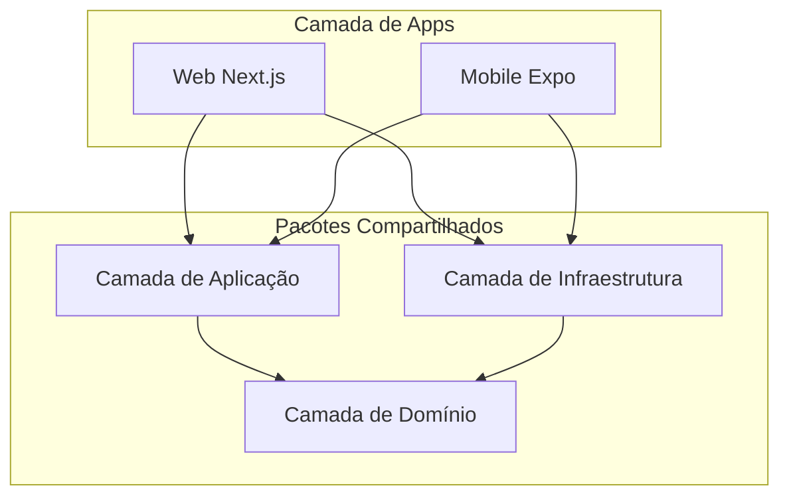
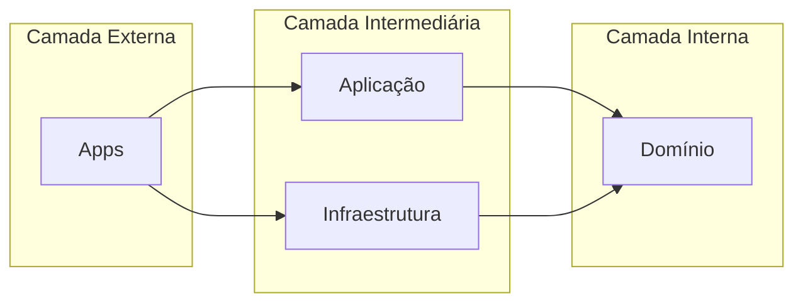
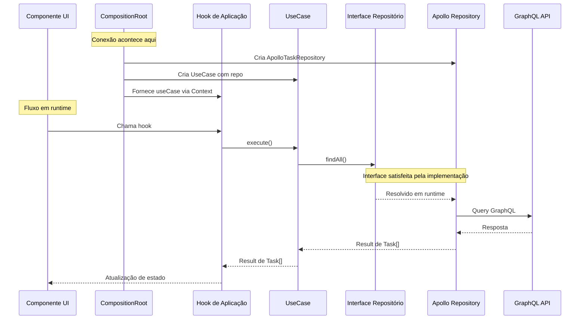

# Por Que Camadas? Um Mergulho Profundo na Clean Architecture

## Propósito

Explicar **por que** este boilerplate usa uma arquitetura em camadas, quais problemas ela resolve, e quando (e quando não) usá-la. Este documento vai além do "o quê" e "como" para abordar o raciocínio fundamental por trás das decisões arquiteturais.

## Quando Ler Isto

- Você está questionando se essa complexidade vale a pena
- Você quer entender a filosofia por trás da Clean Architecture
- Você precisa justificar decisões arquiteturais para seu time
- Você está avaliando se essa abordagem serve para seu projeto

---

## O Problema Que Estamos Resolvendo

Antes de mergulhar nas soluções, vamos entender os problemas que a arquitetura em camadas resolve.

### A Realidade de Codebases "Simples"

A maioria dos projetos começa simples. Um app Next.js com algumas chamadas de API:

```typescript
// ❌ A abordagem "simples" que se torna complexa
// app/tasks/page.tsx

'use client';

import { useQuery, useMutation } from '@apollo/client';
import { gql } from '@apollo/client';
import { useState, useEffect } from 'react';

const GET_TASKS = gql`
  query GetTasks {
    tasks {
      id
      title
      completed
      priority
      createdAt
    }
  }
`;

const CREATE_TASK = gql`
  mutation CreateTask($title: String!) {
    createTask(title: $title) {
      id
      title
      completed
    }
  }
`;

export default function TasksPage() {
  const [filter, setFilter] = useState<'all' | 'active' | 'completed'>('all');
  const { data, loading, error } = useQuery(GET_TASKS);
  const [createTask] = useMutation(CREATE_TASK, {
    refetchQueries: [{ query: GET_TASKS }],
  });

  // Lógica de negócio misturada com UI
  const filteredTasks = data?.tasks?.filter((task) => {
    if (filter === 'active') return !task.completed;
    if (filter === 'completed') return task.completed;
    return true;
  });

  // Mais lógica de negócio: ordenação por prioridade
  const sortedTasks = filteredTasks?.sort((a, b) => {
    // Prioridade 1 é a mais alta
    return a.priority - b.priority;
  });

  // Ainda mais lógica de negócio: validação
  const handleCreate = async (title: string) => {
    if (title.length < 3) {
      alert('O título deve ter pelo menos 3 caracteres');
      return;
    }
    if (title.length > 100) {
      alert('O título deve ter menos de 100 caracteres');
      return;
    }
    await createTask({ variables: { title } });
  };

  // Lógica de formatação de data
  const formatDate = (date: string) => {
    return new Date(date).toLocaleDateString('pt-BR', {
      month: 'short',
      day: 'numeric',
    });
  };

  if (loading) return <div>Carregando...</div>;
  if (error) return <div>Erro: {error.message}</div>;

  return (
    <div>
      {/* Renderização de UI */}
    </div>
  );
}
```

### O Que Há de Errado Com Isso?

À primeira vista, nada. Funciona. Mas vamos analisar os **custos ocultos**:

#### 1. Impossível Testar Lógica de Negócio

```typescript
// Como você testa a lógica de filtragem?
// Não dá. Está dentro de um componente React.
// Você precisa:
// - Configurar React Testing Library
// - Mockar Apollo Client
// - Mockar a resposta GraphQL
// - Renderizar o componente
// - Fazer assertions em elementos DOM

// Tudo isso só para testar: "a filtragem funciona?"
```

#### 2. Duplicação Ao Adicionar Mobile

```typescript
// Agora você precisa da mesma lógica em React Native
// app/screens/TasksScreen.tsx (mobile)

// Copy-paste tudo, adaptar para React Native
const filteredTasks = data?.tasks?.filter((task) => {
  // Mesma lógica, duplicada
  if (filter === 'active') return !task.completed;
  if (filter === 'completed') return task.completed;
  return true;
});

// Mesma validação, duplicada
if (title.length < 3) {
  Alert.alert('Erro', 'O título deve ter pelo menos 3 caracteres');
  return;
}
```

#### 3. Acoplamento Forte ao GraphQL

```typescript
// Sua lógica de negócio conhece a estrutura do GraphQL
const sortedTasks = data?.tasks?.sort(/* ... */);
//                       ^^^^^^
// E se a API mudar de `tasks` para `taskList`?
// E se você mudar para REST?
// Todo componente precisa mudar.
```

#### 4. Lógica de Validação Espalhada

```typescript
// TasksPage.tsx
if (title.length < 3) {
  /* ... */
}

// CreateTaskModal.tsx (outro lugar)
if (title.trim().length < 3) {
  /* ... */
} // Levemente diferente!

// EditTaskForm.tsx (mais outro lugar)
if (!title || title.length < 3) {
  /* ... */
} // Outra variação!

// Qual está certo? Ninguém sabe.
```

#### 5. Tratamento de Erros Inconsistente

```typescript
// Componente A
if (error) return <div>Erro: {error.message}</div>;

// Componente B
if (error) {
  console.error(error);
  return <ErrorPage />;
}

// Componente C
if (error) throw error; // Deixa o error boundary tratar

// Sem estratégia consistente
```

### O Efeito Composto

Esses problemas se acumulam com o tempo:

| Tempo  | Linhas de Código | Cobertura de Testes | Frequência de Bugs | Custo de Mudança |
| ------ | ---------------- | ------------------- | ------------------ | ---------------- |
| Mês 1  | 5.000            | 20%                 | Baixa              | Baixo            |
| Mês 6  | 25.000           | 15%                 | Média              | Médio            |
| Mês 12 | 60.000           | 10%                 | Alta               | Alto             |
| Mês 24 | 120.000          | 5%                  | Muito Alta         | Muito Alto       |

O codebase se torna **progressivamente mais difícil de manter**.

---

## A Solução: Arquitetura em Camadas

A arquitetura em camadas resolve esses problemas **separando responsabilidades** em camadas distintas com funções claras.



---

## Por Que Cada Camada Existe

### Camada de Domínio: "A Verdade"

A camada de domínio é o **coração** da sua aplicação. Ela define **o que** seu negócio é, não como é implementado.

#### O Que Ela Contém

```typescript
// packages/domain/src/features/tasks/entities/task.ts

import { z } from 'zod';

/**
 * Entidade Task
 *
 * Esta é a ÚNICA FONTE DE VERDADE para o que é uma Task.
 * Toda parte do sistema que lida com Tasks deve seguir isso.
 */
export const TaskSchema = z.object({
  id: z.string().uuid(),
  title: z.string().min(3).max(100),
  description: z.string().max(500).optional(),
  completed: z.boolean().default(false),
  priority: z.number().int().min(1).max(5).default(3),
  createdAt: z.coerce.date(),
  updatedAt: z.coerce.date(),
});

export type Task = z.infer<typeof TaskSchema>;

// Tipos derivados para operações específicas
export const CreateTaskInputSchema = TaskSchema.pick({
  title: true,
  description: true,
  priority: true,
});

export type CreateTaskInput = z.infer<typeof CreateTaskInputSchema>;
```

#### Por Que Isso Importa

**1. Única Fonte de Verdade**

Antes:

```typescript
// Tipos definidos em 5 lugares diferentes
// Tipos de API, props de componente, validação de form, schema de banco, testes
// Todos levemente diferentes, todos dessincronizados
```

Depois:

```typescript
// Um lugar define Task
// Todos importam de @repo/domain
// Muda uma vez, propaga pra todo lugar
```

**2. Validação é Declarativa**

Antes:

```typescript
// Validação espalhada pelos componentes
if (title.length < 3) {
  /* ... */
}
if (title.length > 100) {
  /* ... */
}
if (!priority || priority < 1 || priority > 5) {
  /* ... */
}
```

Depois:

```typescript
// Validação definida uma vez no schema
const result = TaskSchema.safeParse(data);
if (!result.success) {
  // Zod fornece mensagens de erro detalhadas
  console.log(result.error.format());
}
```

**3. Independência de Framework**

A camada de domínio tem **zero dependências de framework**:

```typescript
// packages/domain/package.json
{
  "dependencies": {
    "zod": "^3.x"  // Só Zod, nada mais
  }
}
```

Isso significa:

- Testar sem React, Apollo ou qualquer framework
- Reusar em qualquer ambiente JavaScript/TypeScript
- Sobreviver a migrações de framework (React 18 → 19, Apollo 3 → 4)

#### Cenário Real: Mudança no Schema GraphQL

Seu time de backend muda a API:

```graphql
# Antes
type Task {
  id: ID!
  title: String!
  completed: Boolean!
  createdAt: DateTime!
}

# Depois (breaking change!)
type Task {
  id: ID!
  title: String!
  isCompleted: Boolean! # Renomeado!
  timestamps: Timestamps! # Reestruturado!
}

type Timestamps {
  created: DateTime!
  updated: DateTime!
}
```

**Sem camadas:** Mudar 30+ arquivos pelo codebase.

**Com camadas:**

```typescript
// Só muda o mapper (camada de infraestrutura)
export const TaskMapper = {
  toDomain(raw: GraphQLTask): Task {
    return TaskSchema.parse({
      id: raw.id,
      title: raw.title,
      completed: raw.isCompleted, // Mapeia novo nome do campo
      createdAt: raw.timestamps.created, // Mapeia estrutura aninhada
      updatedAt: raw.timestamps.updated,
    });
  },
};

// Domain continua igual
// Application continua igual
// Componentes continuam iguais
```

**Impacto:** 1 arquivo alterado ao invés de 30+.

---

### Camada de Aplicação: "A Orquestração"

A camada de aplicação contém **lógica de negócio** e **casos de uso**. Ela responde à pergunta: "O que os usuários podem fazer com nosso sistema?"

#### O Que Ela Contém

```typescript
// packages/application/src/features/tasks/use-cases/get-tasks.use-case.ts

import {
  Task,
  TaskRepositoryInterface,
  Result,
  success,
  failure,
  DomainError,
} from '@repo/domain';

export interface GetTasksFilter {
  status?: 'all' | 'active' | 'completed';
  sortBy?: 'priority' | 'createdAt';
  sortOrder?: 'asc' | 'desc';
}

/**
 * Use Case de Buscar Tasks
 *
 * Encapsula toda a lógica de negócio para recuperar tasks.
 * Esta é uma classe pura sem efeitos colaterais.
 */
export class GetTasksUseCase {
  constructor(private readonly taskRepository: TaskRepositoryInterface) {}

  async execute(
    filter: GetTasksFilter = {},
  ): Promise<Result<Task[], DomainError>> {
    // 1. Buscar tasks do repositório
    const result = await this.taskRepository.findAll();

    if (!result.ok) {
      return result;
    }

    let tasks = result.value;

    // 2. Aplicar regras de negócio: filtragem
    if (filter.status === 'active') {
      tasks = tasks.filter((t) => !t.completed);
    } else if (filter.status === 'completed') {
      tasks = tasks.filter((t) => t.completed);
    }

    // 3. Aplicar regras de negócio: ordenação
    const sortBy = filter.sortBy ?? 'createdAt';
    const sortOrder = filter.sortOrder ?? 'desc';

    tasks = [...tasks].sort((a, b) => {
      const aValue = a[sortBy];
      const bValue = b[sortBy];

      if (aValue < bValue) return sortOrder === 'asc' ? -1 : 1;
      if (aValue > bValue) return sortOrder === 'asc' ? 1 : -1;
      return 0;
    });

    return success(tasks);
  }
}
```

#### Por Que Isso Importa

**1. Lógica de Negócio é Explícita**

Antes:

```typescript
// Onde está a lógica de filtragem?
// Em TasksPage.tsx? TaskList.tsx? useGetTasks.ts?
// Ninguém sabe, espalhada por todo lugar
```

Depois:

```typescript
// GetTasksUseCase é O lugar para lógica de recuperação de tasks
// É explícito, documentado e testável
```

**2. Testável Sem Frameworks**

```typescript
// packages/application/src/features/tasks/use-cases/get-tasks.use-case.test.ts

import { describe, it, expect, vi } from 'vitest';
import { GetTasksUseCase } from './get-tasks.use-case';
import { success } from '@repo/domain';

describe('GetTasksUseCase', () => {
  it('deve filtrar apenas tasks ativas', async () => {
    // Arrange: Criar um repositório fake
    const mockRepo = {
      findAll: vi.fn().mockResolvedValue(
        success([
          {
            id: '1',
            title: 'Task 1',
            completed: false,
            priority: 1,
            createdAt: new Date(),
          },
          {
            id: '2',
            title: 'Task 2',
            completed: true,
            priority: 2,
            createdAt: new Date(),
          },
          {
            id: '3',
            title: 'Task 3',
            completed: false,
            priority: 3,
            createdAt: new Date(),
          },
        ]),
      ),
    };

    const useCase = new GetTasksUseCase(mockRepo);

    // Act
    const result = await useCase.execute({ status: 'active' });

    // Assert
    expect(result.ok).toBe(true);
    if (result.ok) {
      expect(result.value).toHaveLength(2);
      expect(result.value.every((t) => !t.completed)).toBe(true);
    }
  });

  it('deve ordenar por prioridade ascendente', async () => {
    const mockRepo = {
      findAll: vi.fn().mockResolvedValue(
        success([
          { id: '1', priority: 3, completed: false, createdAt: new Date() },
          { id: '2', priority: 1, completed: false, createdAt: new Date() },
          { id: '3', priority: 2, completed: false, createdAt: new Date() },
        ]),
      ),
    };

    const useCase = new GetTasksUseCase(mockRepo);
    const result = await useCase.execute({
      sortBy: 'priority',
      sortOrder: 'asc',
    });

    expect(result.ok).toBe(true);
    if (result.ok) {
      expect(result.value[0].priority).toBe(1);
      expect(result.value[1].priority).toBe(2);
      expect(result.value[2].priority).toBe(3);
    }
  });
});

// Sem React, sem Apollo, sem GraphQL
// Apenas teste de lógica pura
// Roda em milissegundos
```

**3. Reutilizável Entre Plataformas**

```typescript
// App web
import { GetTasksUseCase } from '@repo/application';

// App mobile - MESMO import, MESMA lógica
import { GetTasksUseCase } from '@repo/application';

// Ferramenta CLI - MESMO import, MESMA lógica
import { GetTasksUseCase } from '@repo/application';

// 100% de reuso de código para lógica de negócio
```

#### Cenário Real: Mudança em Regra de Negócio Complexa

Requisito do produto: "Tasks com prioridade 1 devem sempre aparecer primeiro, independente de outra ordenação."

**Sem camadas:**

- Encontrar todos os lugares que ordenam tasks
- Modificar cada um
- Torcer para não ter esquecido nenhum
- Escrever testes de integração para cada componente

**Com camadas:**

```typescript
// Modifica um use case
export class GetTasksUseCase {
  async execute(
    filter: GetTasksFilter = {},
  ): Promise<Result<Task[], DomainError>> {
    // ... código existente ...

    // NOVO: Tasks prioridade 1 sempre primeiro
    const priority1Tasks = tasks.filter((t) => t.priority === 1);
    const otherTasks = tasks.filter((t) => t.priority !== 1);

    tasks = [...priority1Tasks, ...otherTasks];

    return success(tasks);
  }
}

// Escreve um teste unitário
it('deve sempre mostrar tasks prioridade 1 primeiro', async () => {
  // Testa a regra de negócio específica
});

// Pronto. Todas as plataformas automaticamente têm o novo comportamento.
```

---

### Camada de Infraestrutura: "O Adaptador"

A camada de infraestrutura contém **implementações técnicas**. Ela responde: "Como realmente buscamos/armazenamos dados?"

#### O Que Ela Contém

```typescript
// packages/infrastructure/src/features/tasks/repositories/apollo-task-repository.ts

import { ApolloClient } from '@apollo/client';
import {
  Task,
  TaskRepositoryInterface,
  CreateTaskInput,
  Result,
  success,
  failure,
  DomainError,
  NetworkError,
} from '@repo/domain';
import { GetTasksDocument, CreateTaskDocument } from '@repo/graphql';
import { TaskMapper } from '../mappers/task.mapper';

/**
 * Implementação Apollo do TaskRepository
 *
 * Este é o ÚNICO lugar que conhece GraphQL.
 * O resto da aplicação não sabe que GraphQL existe.
 */
export class ApolloTaskRepository implements TaskRepositoryInterface {
  constructor(private readonly client: ApolloClient<unknown>) {}

  async findAll(): Promise<Result<Task[], DomainError>> {
    try {
      const { data } = await this.client.query({
        query: GetTasksDocument,
        fetchPolicy: 'network-only',
      });

      if (!data?.tasks) {
        return success([]);
      }

      // Mapeia resposta GraphQL para entidades de domínio
      const tasks = TaskMapper.toDomainList(data.tasks);
      return success(tasks);
    } catch (error) {
      return failure(new NetworkError('Falha ao buscar tasks', error));
    }
  }

  async create(input: CreateTaskInput): Promise<Result<Task, DomainError>> {
    try {
      const { data } = await this.client.mutate({
        mutation: CreateTaskDocument,
        variables: input,
      });

      if (!data?.createTask) {
        return failure(new NetworkError('Falha ao criar task'));
      }

      const task = TaskMapper.toDomain(data.createTask);
      return success(task);
    } catch (error) {
      return failure(new NetworkError('Falha ao criar task', error));
    }
  }
}
```

#### Por Que Isso Importa

**1. Tecnologia é Substituível**

Quer trocar Apollo por React Query? Ou GraphQL por REST?

```typescript
// Opção 1: Apollo Client
export class ApolloTaskRepository implements TaskRepositoryInterface {
  /* ... */
}

// Opção 2: React Query
export class ReactQueryTaskRepository implements TaskRepositoryInterface {
  /* ... */
}

// Opção 3: REST API
export class RestTaskRepository implements TaskRepositoryInterface {
  async findAll(): Promise<Result<Task[], DomainError>> {
    const response = await fetch('/api/v2/tasks');
    const data = await response.json();
    return success(TaskMapper.toDomainList(data.items));
  }
}

// Opção 4: Local storage (para offline-first)
export class LocalStorageTaskRepository implements TaskRepositoryInterface {
  async findAll(): Promise<Result<Task[], DomainError>> {
    const data = JSON.parse(localStorage.getItem('tasks') || '[]');
    return success(TaskMapper.toDomainList(data));
  }
}

// A interface continua igual
// Camada de aplicação não muda
// Só troca a implementação no composition root
```

**2. Mappers Protegem a Fronteira**

```typescript
// packages/infrastructure/src/features/tasks/mappers/task.mapper.ts

import { Task, TaskSchema } from '@repo/domain';

/**
 * Task Mapper
 *
 * Converte formatos de dados externos para entidades de domínio.
 * É aqui que mudanças externas são absorvidas.
 */
export const TaskMapper = {
  /**
   * Converte dados brutos da API para uma entidade Task validada
   *
   * Se a estrutura da API mudar, atualize ESTA função.
   * Todo o resto continua igual.
   */
  toDomain(raw: unknown): Task {
    // Zod valida e transforma
    return TaskSchema.parse(raw);
  },

  toDomainList(rawList: unknown[]): Task[] {
    return rawList.map((raw) => TaskSchema.parse(raw));
  },

  /**
   * Converte entidade de domínio para formato da API (para mutations)
   */
  toApi(task: Task): Record<string, unknown> {
    return {
      id: task.id,
      title: task.title,
      description: task.description ?? null,
      completed: task.completed,
      priority: task.priority,
    };
  },
};
```

**3. Cache e Otimização São Isolados**

```typescript
// Adicionar cache não afeta a lógica de aplicação
export class CachedTaskRepository implements TaskRepositoryInterface {
  constructor(
    private readonly baseRepo: TaskRepositoryInterface,
    private readonly cache: CacheService,
  ) {}

  async findAll(): Promise<Result<Task[], DomainError>> {
    // Verifica cache primeiro
    const cached = await this.cache.get<Task[]>('tasks');
    if (cached) {
      return success(cached);
    }

    // Fallback para repositório base
    const result = await this.baseRepo.findAll();

    if (result.ok) {
      await this.cache.set('tasks', result.value, { ttl: 60 });
    }

    return result;
  }
}

// Use transparentemente
const repo = new CachedTaskRepository(
  new ApolloTaskRepository(client),
  new RedisCache(),
);
```

#### Cenário Real: Migrando de GraphQL para REST

Sua empresa decide migrar de GraphQL para REST API.

**Sem camadas:**

- Encontrar cada chamada `useQuery` e `useMutation`
- Reescrever para `fetch` ou `axios`
- Atualizar transformação de dados em 50+ lugares
- Rezar para nada quebrar

**Com camadas:**

```typescript
// Passo 1: Criar novo repositório
export class RestTaskRepository implements TaskRepositoryInterface {
  async findAll(): Promise<Result<Task[], DomainError>> {
    const response = await fetch('/api/v2/tasks');
    const data = await response.json();
    return success(TaskMapper.toDomainList(data.items));
  }
}

// Passo 2: Atualizar composition root
// apps/web/src/providers/UseCasesProvider.tsx

// Antes
const taskRepo = new ApolloTaskRepository(apolloClient);

// Depois
const taskRepo = new RestTaskRepository();

// Passo 3: Pronto. Todo o resto funciona automaticamente.
```

**Impacto:** 2-3 arquivos alterados. 0 componentes tocados.

---

## Cenários de Evolução do Mundo Real

### Cenário 1: Adicionando um App Mobile

**Dia 1:** Só app web
**Dia 100:** Precisa de apps iOS e Android

**Sem camadas:**

```
Arquivos para escrever no mobile:
├── screens/TasksScreen.tsx (copia do web, adapta)
├── screens/CreateTaskScreen.tsx (copia do web, adapta)
├── hooks/useGetTasks.ts (copia, adapta Apollo para React Native)
├── hooks/useCreateTask.ts (copia, adapta)
├── utils/taskFiltering.ts (copia, percebe que web tem bugs, conserta ambos)
├── utils/taskSorting.ts (copia, implementação diferente de algum jeito)
├── types/task.ts (copia, agora tem 2 fontes de verdade)
└── ... mais 20 arquivos
```

Total: **~3.000 linhas de código duplicado/adaptado**

**Com camadas:**

```
Arquivos para escrever no mobile:
├── screens/TasksScreen.tsx (só UI, usa hooks compartilhados)
├── screens/CreateTaskScreen.tsx (só UI)
├── providers/AppProviders.tsx (conecta pacotes compartilhados)
└── ... mais 5 arquivos de UI
```

Compartilhado automaticamente:

- Entidades e validação de domínio
- Todos os use cases e lógica de negócio
- Implementações de repositório
- Mappers e tratamento de erros

Total: **~500 linhas de código novo** (só UI)

**Reuso de código: 80-90%**

### Cenário 2: Breaking Change no Backend

Time de API refatora o endpoint de tasks:

```graphql
# Antes
query GetTasks {
  tasks {
    id
    title
    completed
  }
}

# Depois
query GetTasks {
  taskConnection {
    edges {
      node {
        taskId
        taskTitle
        status
      }
    }
    pageInfo {
      hasNextPage
    }
  }
}
```

**Sem camadas:**

| Arquivo                    | Mudanças Necessárias            |
| -------------------------- | ------------------------------- |
| hooks/useGetTasks.ts       | Atualizar query, destructuring  |
| components/TaskList.tsx    | Atualizar acesso a propriedades |
| components/TaskItem.tsx    | Atualizar acesso a propriedades |
| components/TaskFilters.tsx | Atualizar lógica de filtro      |
| pages/tasks/[id].tsx       | Atualizar task individual       |
| utils/taskHelpers.ts       | Atualizar referências de tipo   |
| tests/\*.test.tsx          | Atualizar mocks e assertions    |
| **Total**                  | **15-20 arquivos**              |

**Com camadas:**

| Arquivo                               | Mudanças Necessárias           |
| ------------------------------------- | ------------------------------ |
| graphql/queries/tasks.graphql         | Atualizar estrutura da query   |
| infrastructure/mappers/task.mapper.ts | Atualizar mapeamento de campos |
| **Total**                             | **2 arquivos**                 |

### Cenário 3: Adicionando Lógica de Negócio Complexa

Novo requisito: "Usuários premium podem ter tasks ilimitadas, usuários free são limitados a 10."

**Sem camadas:**

```typescript
// Onde colocar essa lógica?

// Opção A: No componente (ruim)
function TasksPage() {
  const { user } = useAuth();
  const { data: tasks } = useGetTasks();

  if (!user.isPremium && tasks.length >= 10) {
    // Bloqueia criação... mas CreateTaskModal também precisa dessa verificação
    // E o app mobile também
  }
}

// Opção B: No hook (levemente melhor, ainda duplicado entre apps)
function useGetTasks() {
  // Lógica premium aqui
  // Mas duplicada em useCreateTask também
}
```

**Com camadas:**

```typescript
// packages/application/src/features/tasks/use-cases/create-task.use-case.ts

export class CreateTaskUseCase {
  constructor(
    private readonly taskRepo: TaskRepositoryInterface,
    private readonly userRepo: UserRepositoryInterface,
  ) {}

  async execute(input: CreateTaskInput): Promise<Result<Task, DomainError>> {
    // Regra de negócio: Usuários free limitados a 10 tasks
    const userResult = await this.userRepo.getCurrentUser();
    if (!userResult.ok) return userResult;

    const user = userResult.value;

    if (!user.isPremium) {
      const tasksResult = await this.taskRepo.findAll();
      if (tasksResult.ok && tasksResult.value.length >= 10) {
        return failure(
          new BusinessError(
            'FREE_TIER_LIMIT',
            'Usuários free só podem ter 10 tasks. Faça upgrade para premium para tasks ilimitadas.',
          ),
        );
      }
    }

    return this.taskRepo.create(input);
  }
}

// UM lugar para a regra
// Automaticamente aplicada em web, mobile, API
// Fácil de testar
// Fácil de modificar
```

---

## Fluxo de Dependências: Um Mergulho Profundo

### Dependências em Tempo de Compilação



**Regra Fundamental:** Dependências apontam para dentro. Camadas internas nunca importam de camadas externas.

### Por Que Camadas Internas Não Importam das Externas

```typescript
// ❌ ERRADO: Domain importando de Infrastructure
// packages/domain/src/features/tasks/entities/task.ts

import { ApolloTaskRepository } from '@repo/infrastructure'; // VIOLAÇÃO!

// Isso significaria:
// - Domain não pode existir sem infrastructure
// - Não dá para testar domain sem Apollo
// - Domain muda quando infrastructure muda
```

```typescript
// ✅ CORRETO: Domain define interfaces
// packages/domain/src/features/tasks/repositories/task-repository.interface.ts

export interface TaskRepositoryInterface {
  findAll(): Promise<Result<Task[], DomainError>>;
  create(input: CreateTaskInput): Promise<Result<Task, DomainError>>;
}

// Infrastructure implementa a interface
// packages/infrastructure/src/features/tasks/repositories/apollo-task-repository.ts

export class ApolloTaskRepository implements TaskRepositoryInterface {
  // Detalhes de implementação aqui
}
```

### Inversão de Dependência em Ação



---

## Trade-offs: Brutalmente Honestos

### Vantagens

| Benefício                      | Impacto | Medição                                                                 |
| ------------------------------ | ------- | ----------------------------------------------------------------------- |
| **Testabilidade**              | Alto    | Cobertura de testes unitários pode chegar a 90%+ para lógica de negócio |
| **Reusabilidade**              | Alto    | 80-90% de compartilhamento de código entre web e mobile                 |
| **Manutenibilidade**           | Alto    | Correções de bug em um lugar, propagam para todos                       |
| **Escalabilidade de Time**     | Alto    | Times podem trabalhar em diferentes camadas sem conflitos               |
| **Independência de Framework** | Médio   | Domain e Application podem sobreviver ao React                          |
| **Onboarding**                 | Médio   | Estrutura clara ajuda compreensão (uma vez aprendida)                   |

### Desvantagens

| Desvantagem                   | Impacto | Mitigação                          |
| ----------------------------- | ------- | ---------------------------------- |
| **Complexidade Inicial**      | Alto    | Use geradores, siga templates      |
| **Mais Arquivos**             | Médio   | Boa navegação de IDE, nomes claros |
| **Boilerplate**               | Médio   | Geradores de código, snippets      |
| **Curva de Aprendizado**      | Alto    | Documentação, exemplos             |
| **Exagero para Apps Simples** | Alto    | Não use para landing pages         |

### Quando Usar Esta Arquitetura

**Use quando:**

- Construindo para múltiplas plataformas (web + mobile)
- Lógica de negócio complexa (não é só CRUD)
- Time > 3 desenvolvedores
- Vida útil do projeto > 6 meses
- Alta cobertura de testes necessária
- Aplicações enterprise ou financeiras
- Compliance regulatório necessário

**Não use quando:**

- Páginas de marketing/landing
- CRUD simples com < 5 entidades
- MVPs com < 1 mês de prazo
- Protótipos de desenvolvedor solo
- Ferramentas internas pontuais
- Sites estáticos

### O Orçamento de Complexidade

Pense na complexidade arquitetural como um orçamento:

```
Score de Complexidade do Projeto:
┌────────────────────────────────────────────────────────┐
│ CRUD simples          │ ████░░░░░░░░░░░░░░░░ 20%      │
│ + Múltiplas plataf.   │ ████████░░░░░░░░░░░░ 40%      │
│ + Negócio complexo    │ ████████████░░░░░░░░ 60%      │
│ + Regulatório         │ ████████████████░░░░ 80%      │
│ + Múltiplos times     │ ████████████████████ 100%     │
└────────────────────────────────────────────────────────┘

Se seu projeto é < 40%, arquitetura mais simples pode bastar.
Se seu projeto é > 60%, arquitetura em camadas dá dividendos.
```

---

## Comparação com Alternativas

### MVC Tradicional

```
┌─────────────────────────────────────────────────────────┐
│ MVC                          │ Arquitetura em Camadas  │
├─────────────────────────────────────────────────────────┤
│ View-Controller-Model        │ UI-App-Domain-Infra     │
│ Frequentemente mistura       │ Separação estrita       │
│ UI/negócio                   │                         │
│ Model = formato do banco     │ Domain = formato negócio│
│ Bom para server-rendered     │ Bom para SPAs, mobile   │
└─────────────────────────────────────────────────────────┘
```

### Feature Folders (Sem Camadas)

```
┌─────────────────────────────────────────────────────────┐
│ Feature Folders              │ Camadas + Feature-Based │
├─────────────────────────────────────────────────────────┤
│ Todo código em uma pasta     │ Features divididas por  │
│                              │ camada                  │
│ Navegação simples            │ Responsabilidades claras│
│ Pode ficar bagunçado dentro  │ Cada slice é limpo      │
│ Bom para apps pequenos-médios│ Bom para apps complexos │
└─────────────────────────────────────────────────────────┘
```

### Next.js Monolítico

```
┌─────────────────────────────────────────────────────────┐
│ Next.js Monolítico           │ Arquitetura em Camadas  │
├─────────────────────────────────────────────────────────┤
│ Rápido para começar          │ Setup inicial mais lento│
│ Componentes fazem tudo       │ Separação clara         │
│ Difícil compartilhar mobile  │ Compartilhamento fácil  │
│ Testes precisam de React     │ Teste de lógica pura    │
│ Bom para protótipos          │ Bom para produção       │
└─────────────────────────────────────────────────────────┘
```

---

## Equívocos Comuns

### "É Over-Engineering"

**Realidade:** É **engenharia apropriada** para sistemas complexos.

Um prédio de 5 andares não precisa da mesma fundação de um arranha-céu. Mas se você está construindo um arranha-céu sobre fundação de casa, isso é **under-engineering**.

A pergunta não é "isso é complexo?" mas "meu projeto justifica essa complexidade?"

### "Muito Boilerplate"

**Realidade:** Boilerplate tem ROI.

```typescript
// "Boilerplate" que você escreve uma vez:
export class GetTasksUseCase {
  constructor(private readonly repo: TaskRepositoryInterface) {}
  // ...
}

// Valor que você ganha para sempre:
// - Testável sem React
// - Reutilizável entre plataformas
// - Documentação clara
// - Contratos type-safe
```

### "Atrasa o Desenvolvimento"

**Realidade:** Atrasa a semana 1, acelera o mês 6.

```
Velocidade de Desenvolvimento ao Longo do Tempo:

Sem camadas:  ████████████████▒▒▒▒▒▒░░░░░░░░░░
              Início rápido ──────► Cada vez mais lento

Com camadas:  ██▒▒▒▒▒▒████████████████████████
              Início lento ──► Velocidade consistente
```

### "Só para Times Grandes"

**Realidade:** Desenvolvedores solo também se beneficiam.

- Seu eu do futuro é um "membro do time" diferente
- Code review é mais fácil com fronteiras claras
- Refatoração é mais segura com testes
- Documentação está embutida na estrutura

---

## Referências

- **Clean Architecture** - Robert C. Martin: `https://blog.cleancoder.com/uncle-bob/2012/08/13/the-clean-architecture.html`
- **Hexagonal Architecture** - Alistair Cockburn: `https://alistair.cockburn.us/hexagonal-architecture/`
- **Domain-Driven Design** - Eric Evans: `https://www.domainlanguage.com/ddd/`
- **Princípios SOLID** - Wikipedia: `https://en.wikipedia.org/wiki/SOLID`
- **Functional Core, Imperative Shell** - Gary Bernhardt: `https://www.destroyallsoftware.com/screencasts/catalog/functional-core-imperative-shell`
- **Feature-Sliced Design**: `https://feature-sliced.design/`
- **Zod**: `https://zod.dev/`
