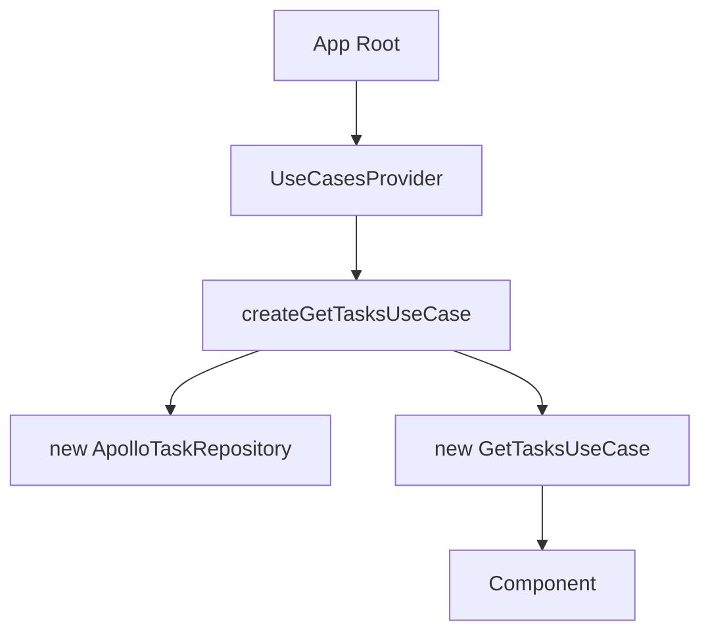

# Composition Root - Pattern

## Purpose

**Composition Root** is the single place in the application where dependencies are "wired up". It's where we say "use this concrete repository for this use case".

## Why Use It?

### Problem: `new` scattered throughout the application

```typescript
// ❌ Bad: each component creates its own dependencies
function TaskList() {
  const client = useApolloClient();
  const repository = new ApolloTaskRepository(client);
  const useCase = new GetTasksUseCase(repository);
  const result = await useCase.execute();
  // ...
}
```

**Problems:**
- Duplicated code in each component
- Hard to test (hardcoded dependencies)
- Hard to swap implementations
- Violates DRY (Don't Repeat Yourself)

### Solution: Centralize dependency creation

```typescript
// ✅ Good: factory creates dependencies
export function createGetTasksUseCase(client: ApolloClient) {
  const repository = new ApolloTaskRepository(client);
  return new GetTasksUseCase(repository);
}

// ✅ Good: provider exposes ready-to-use use cases
function TaskList() {
  const { getTasksUseCase } = useUseCases();
  // ...
}
```

## How It Works in the Project

### 1. Factory (Composition Root)

```typescript
// packages/application/src/factories/use-cases.factory.ts
import { ApolloClient } from '@apollo/client';
import { ApolloTaskRepository } from '@repo/infrastructure';
import { GetTasksUseCase } from '../use-cases/get-tasks.use-case';

export function createGetTasksUseCase(client: ApolloClient<any>) {
  const repository = new ApolloTaskRepository(client);
  return new GetTasksUseCase(repository);
}
```

### 2. Provider (React Context)

```typescript
// apps/web/src/providers/UseCasesProvider.tsx
export function UseCasesProvider({ children }) {
  const client = useApolloClient();

  const useCases = useMemo(
    () => ({
      getTasksUseCase: createGetTasksUseCase(client),
    }),
    [client]
  );

  return (
    <UseCasesContext.Provider value={useCases}>
      {children}
    </UseCasesContext.Provider>
  );
}
```

### 3. Access Hook

```typescript
// apps/web/src/providers/UseCasesProvider.tsx
export function useUseCases() {
  const context = useContext(UseCasesContext);
  if (!context) {
    throw new Error('useUseCases must be used within UseCasesProvider');
  }
  return context;
}
```

### 4. Usage in UI

```typescript
// apps/web/app/page.tsx
function Home() {
  const { getTasksUseCase } = useUseCases();
  // use case comes ready with all dependencies injected
}
```

## Creation Flow



## When to Use

### ✅ Use Composition Root for:

- Creating **use case** instances
- Creating **repository** instances
- Injecting **HTTP clients** (Apollo, Axios, etc.)
- Configuring **external services** (analytics, auth, etc.)

### ❌ DON'T use for:

- Business logic (goes in use case)
- Data validation (goes in domain with Zod)
- React components (use directly)
- Simple hooks (use directly)

## Benefits

### 1. Testability

```typescript
// Test: inject mock easily
const mockClient = createMockApolloClient();
const useCase = createGetTasksUseCase(mockClient);
```

### 2. Flexibility

```typescript
// Swap implementation in a single place
export function createGetTasksUseCase(client: ApolloClient) {
  // Before: ApolloTaskRepository
  // After: RestTaskRepository
  const repository = new RestTaskRepository(axiosClient);
  return new GetTasksUseCase(repository);
}
```

### 3. DRY (Don't Repeat Yourself)

Without composition root:
- 10 components = 10x `new ApolloTaskRepository` + `new GetTasksUseCase`

With composition root:
- 10 components = 10x `useUseCases()` (factory called 1x)

## Common Mistakes

### ❌ Creating dependencies inside components

```typescript
// Bad: creation logic scattered
function TaskList() {
  const repo = new ApolloTaskRepository(client);
  const useCase = new GetTasksUseCase(repo);
  // ...
}
```

### ✅ Use provider/factory

```typescript
// Good: dependencies come ready
function TaskList() {
  const { getTasksUseCase } = useUseCases();
  // ...
}
```

### ❌ Multiple composition roots

```typescript
// Bad: factories scattered in multiple places
// apps/web/utils/factories.ts
// apps/web/lib/use-cases.ts
// apps/web/hooks/factories.ts
```

### ✅ Single centralized provider

```typescript
// Good: single place
// apps/web/src/providers/UseCasesProvider.tsx
```

### ❌ Business logic in provider

```typescript
// Bad: business rule in provider
export function UseCasesProvider({ children }) {
  const client = useApolloClient();
  
  // ❌ Don't do this here!
  const filteredTasks = tasks.filter(t => t.completed);
  
  return <Context.Provider value={...} />;
}
```

### ✅ Provider only assembles dependencies

```typescript
// Good: provider only creates instances
export function UseCasesProvider({ children }) {
  const client = useApolloClient();
  
  const useCases = useMemo(
    () => ({
      getTasksUseCase: createGetTasksUseCase(client),
    }),
    [client]
  );
  
  return <Context.Provider value={useCases}>{children}</Context.Provider>;
}
```

## Links

- Mark Seemann - Dependency Injection: https://blog.ploeh.dk/2011/07/28/CompositionRoot/
- Clean Architecture (Uncle Bob): https://blog.cleancoder.com/uncle-bob/2012/08/13/the-clean-architecture.html
- Dependency Injection Principles: https://www.martinfowler.com/articles/injection.html

