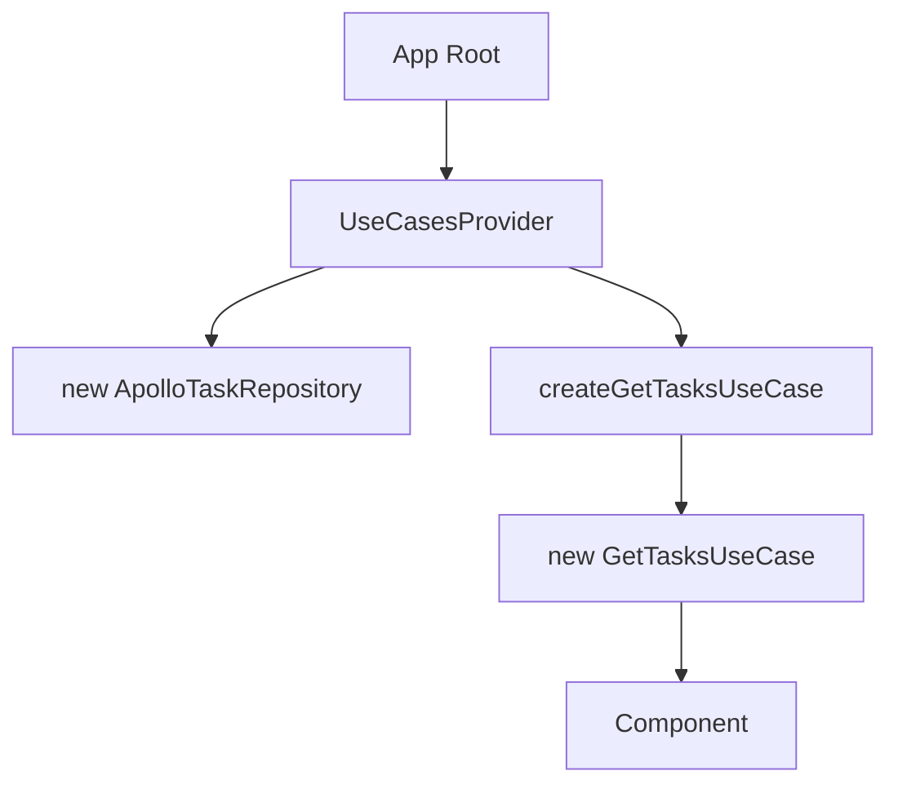

# Composition Root - Pattern

## Propósito

**Composition Root** é o único lugar na aplicação onde as dependências são "montadas" (wired up). É onde dizemos "use este repositório concreto para este use case".

## Por Que Usar?

### Problema: `new` espalhado por toda a aplicação

```typescript
// ❌ Ruim: cada componente cria suas próprias dependências
function TaskList() {
  const client = useApolloClient();
  const repository = new ApolloTaskRepository(client);
  const useCase = new GetTasksUseCase(repository);
  const result = await useCase.execute();
  // ...
}
```

**Problemas:**

- Código duplicado em cada componente
- Difícil de testar (dependências hardcoded)
- Difícil de trocar implementações
- Viola DRY (Don't Repeat Yourself)

### Solução: Centralizar criação de dependências

```typescript
// ✅ Bom: factory cria dependências
export function createGetTasksUseCase(client: ApolloClient) {
  const repository = new ApolloTaskRepository(client);
  return new GetTasksUseCase(repository);
}

// ✅ Bom: provider expõe use cases prontos
function TaskList() {
  const { getTasksUseCase } = useUseCases();
  // ...
}
```

## Como Funciona no Projeto

### 1. Factory (Application Layer)

A factory recebe uma **interface de repositório**, não uma implementação de infraestrutura.
Isso mantém a Application Layer pura e agnóstica de infraestrutura.

```typescript
// packages/application/src/factories/use-cases.factory.ts
import { TaskRepositoryInterface } from '@repo/domain';
import { GetTasksUseCase } from '../use-cases/get-tasks.use-case';

export function createGetTasksUseCase(repository: TaskRepositoryInterface) {
  return new GetTasksUseCase(repository);
}
```

### 2. Provider (Verdadeiro Composition Root)

O **Provider** é o verdadeiro Composition Root - ele cria as implementações de infraestrutura
e injeta nos use cases.

```typescript
// apps/web/src/providers/UseCasesProvider.tsx
import { ApolloTaskRepository } from '@repo/infrastructure';

export function UseCasesProvider({ children }) {
  const client = useApolloClient();

  const useCases = useMemo(() => {
    // Cria implementações de infraestrutura
    const taskRepository = new ApolloTaskRepository(client);

    // Conecta use cases com repositórios
    return {
      getTasksUseCase: createGetTasksUseCase(taskRepository),
    };
  }, [client]);

  return (
    <UseCasesContext.Provider value={useCases}>
      {children}
    </UseCasesContext.Provider>
  );
}
```

### 3. Hook de Acesso

```typescript
// apps/web/src/providers/UseCasesProvider.tsx
export function useUseCases() {
  const context = useContext(UseCasesContext);
  if (!context) {
    throw new Error('useUseCases must be used within UseCasesProvider');
  }
  return context;
}
```

### 4. Uso na UI

```typescript
// apps/web/app/page.tsx
function Home() {
  const { getTasksUseCase } = useUseCases();
  // use case já vem pronto com todas as dependências injetadas
}
```

## Fluxo de Criação



> **Nota**: O Provider cria o repositório (infraestrutura) e passa para a factory.
> A factory só orquestra - ela não conhece implementações concretas.

## Quando Usar

### ✅ Use Composition Root para:

- Criar instâncias de **use cases**
- Criar instâncias de **repositórios**
- Injetar **clientes HTTP** (Apollo, Axios, etc.)
- Configurar **serviços externos** (analytics, auth, etc.)

### ❌ NÃO use para:

- Lógica de negócio (vai no use case)
- Validação de dados (vai no domain com Zod)
- Componentes React (use direto)
- Hooks simples (use direto)

## Benefícios

### 1. Testabilidade

```typescript
// Teste: injetar mock repository facilmente
const mockRepository: TaskRepositoryInterface = {
  findAll: vi.fn().mockResolvedValue(success([{ id: '1', title: 'Test' }])),
};
const useCase = createGetTasksUseCase(mockRepository);
```

### 2. Flexibilidade

```typescript
// Trocar implementação no Provider (Composition Root)
const useCases = useMemo(() => {
  // Antes: ApolloTaskRepository
  // Depois: RestTaskRepository
  const taskRepository = new RestTaskRepository(axiosClient);

  return {
    getTasksUseCase: createGetTasksUseCase(taskRepository),
  };
}, [axiosClient]);
```

### 3. DRY (Don't Repeat Yourself)

Sem composition root:

- 10 componentes = 10x `new ApolloTaskRepository` + `new GetTasksUseCase`

Com composition root:

- 10 componentes = 10x `useUseCases()` (factory chamado 1x)

## Erros Comuns

### ❌ Criar dependências dentro de componentes

```typescript
// Ruim: lógica de criação espalhada
function TaskList() {
  const repo = new ApolloTaskRepository(client);
  const useCase = new GetTasksUseCase(repo);
  // ...
}
```

### ✅ Usar provider/factory

```typescript
// Bom: dependências vêm prontas
function TaskList() {
  const { getTasksUseCase } = useUseCases();
  // ...
}
```

### ❌ Múltiplos composition roots

```typescript
// Ruim: factories espalhadas em vários lugares
// apps/web/utils/factories.ts
// apps/web/lib/use-cases.ts
// apps/web/hooks/factories.ts
```

### ✅ Um único provider centralizado

```typescript
// Bom: um único lugar
// apps/web/src/providers/UseCasesProvider.tsx
```

### ❌ Lógica de negócio no provider

```typescript
// Ruim: regra de negócio no provider
export function UseCasesProvider({ children }) {
  const client = useApolloClient();

  // ❌ Não faça isso aqui!
  const filteredTasks = tasks.filter(t => t.completed);

  return <Context.Provider value={...} />;
}
```

### ✅ Provider só monta dependências

```typescript
// Bom: provider cria repositórios e conecta use cases
export function UseCasesProvider({ children }) {
  const client = useApolloClient();

  const useCases = useMemo(() => {
    const taskRepository = new ApolloTaskRepository(client);
    return {
      getTasksUseCase: createGetTasksUseCase(taskRepository),
    };
  }, [client]);

  return <Context.Provider value={useCases}>{children}</Context.Provider>;
}
```

## Links

- Mark Seemann - Dependency Injection: https://blog.ploeh.dk/2011/07/28/CompositionRoot/
- Clean Architecture (Uncle Bob): https://blog.cleancoder.com/uncle-bob/2012/08/13/the-clean-architecture.html
- Dependency Injection Principles: https://www.martinfowler.com/articles/injection.html
