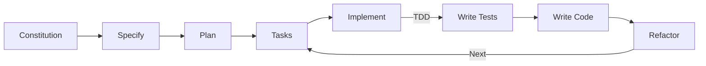
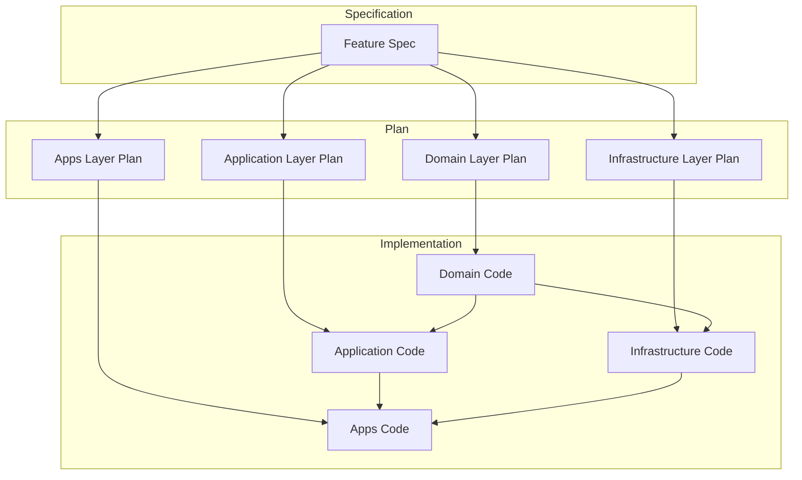
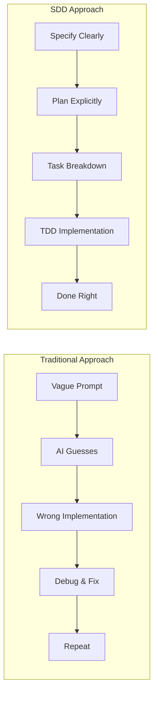

# Spec-Driven Development (SDD) with Spec Kit (EN)

## Purpose

Prevent the "vague prompt problem" where AI agents make wrong assumptions, by using a **structured specification-first approach** that aligns perfectly with Clean Architecture principles.

## When to use

Use Spec-Driven Development any time you:

- Add a new feature or capability to the project
- Make significant architectural changes
- Need precise AI assistance for complex implementations
- Want to document decision-making for the team

## The Problem: Vague Prompts

Traditional AI-assisted development often looks like this:

```
Developer: "Add user authentication to my app"

AI: *guesses*
- OAuth? JWT? Session cookies?
- Where to store tokens?
- What user fields are needed?
- Which layer handles what?
- How to structure the API?

Result: Wrong implementation, wasted time, architectural violations
```

The AI is forced to make thousands of implicit decisions because the prompt lacks specificity. In a Clean Architecture project, this is especially dangerous because:

1. **Layer boundaries are strict** — wrong guesses cause dependency violations
2. **Patterns are enforced** — Result Pattern, Zod schemas, etc. must be followed
3. **Testing is mandatory** — TDD requires clear specifications before tests
4. **Consistency matters** — naming conventions and file structure have rules

## The Solution: Spec-Driven Development

SDD flips the script. Instead of asking AI to implement vaguely, you first **specify precisely what you want**, then let AI execute with clarity:

```
Developer: Uses /speckit.specify to define:
- Exactly what authentication means (JWT, no OAuth)
- User entity fields (id, email, name, createdAt)
- Which layers handle what
- Error scenarios and validations
- Integration with existing patterns

AI: Understands completely
- Follows the specification exactly
- Respects architectural boundaries
- Implements with correct patterns
- Writes proper tests

Result: Correct implementation first time
```

## Why SDD for This Project?

### 1. Clean Architecture Demands Precision

Clean Architecture has strict layer separation:

```
Domain → Application → Infrastructure → Apps
```

Each layer has specific responsibilities. SDD ensures:

- **Domain boundaries are clear**: Entity definitions, repository interfaces
- **Application logic is explicit**: Use cases, hooks, factories
- **Infrastructure is separated**: Apollo implementations, mappers
- **Apps only compose**: Composition Root wiring

Without specifications, AI might:

- Put business logic in components (violates Domain)
- Import infrastructure in application (violates Dependency Inversion)
- Skip the Result Pattern (violates error handling rules)
- Create monolithic hooks (violates Single Responsibility)

### 2. TDD Requires Clear Specifications

Test-Driven Development needs **clear acceptance criteria** before writing tests:

```
❌ Without SDD:
"Write tests for user authentication"
→ What scenarios? What edge cases? What's success?

✅ With SDD:
Specification defines:
- Success: valid credentials → return User
- Failure: invalid email → return ValidationError
- Failure: wrong password → return AuthenticationError
- Edge: network failure → return NetworkError

→ Tests write themselves from the spec
```

### 3. Educational Value

This boilerplate is educational. SDD creates:

- **Documented decision history**: Why this approach?
- **Traceable requirements**: What was requested vs implemented
- **Learning material**: New developers understand the reasoning

### 4. Consistency at Scale

As features grow, consistency becomes harder. The **Constitution** ensures every feature follows the same principles, regardless of when it was added or who added it.

## How Spec Kit Works

Spec Kit provides a structured workflow with 5 main phases:



### Phase 1: Constitution (`/speckit.constitution`)

The **Constitution** defines unchanging project principles. Think of it as the "law" that all features must follow.

Location: `.specify/memory/constitution.md`

For this boilerplate, the Constitution enforces:

- Clean Architecture layer separation
- Result Pattern for error handling
- TDD as mandatory practice
- Apollo Client for data fetching
- Zod for entity validation

**When to update**: Rarely. Only when fundamental project principles change.

### Phase 2: Specify (`/speckit.specify`)

The **Specification** captures **what** you want and **why**.

This phase produces a detailed document answering:

- What is the feature?
- Who uses it?
- What are the inputs/outputs?
- What are the success criteria?
- What are the edge cases?
- What are the constraints?

**Example output** (`.specify/memory/spec.md`):

```markdown
# User Profile Feature Specification

## Overview

Allow users to view and update their profile information.

## User Stories

- As a user, I want to see my profile details
- As a user, I want to update my name and avatar

## Entities

- User: id, email, name, avatarUrl, createdAt

## Operations

- getProfile(): Returns current user's profile
- updateProfile(name, avatarUrl): Updates profile, returns updated User

## Error Scenarios

- NetworkError: API unreachable
- ValidationError: Invalid input (name too short, invalid URL)
- AuthenticationError: User not authenticated

## Constraints

- Must use Zod for validation
- Must return Result types
- Must follow Clean Architecture layers
```

### Phase 3: Plan (`/speckit.plan`)

The **Plan** defines **how** to implement the specification.

This phase maps requirements to your architecture:

```markdown
# User Profile Implementation Plan

## Domain Layer

- Create UserProfileSchema (Zod)
- Create UserProfileRepositoryInterface
- Create useGetProfile and useUpdateProfile contracts

## Application Layer

- Create GetProfileUseCase
- Create UpdateProfileUseCase
- Create useProfile hook (orchestration)

## Infrastructure Layer

- Create UserProfileMapper
- Create ApolloUserProfileRepository
- Create useApolloGetProfile hook
- Create useApolloUpdateProfile hook

## GraphQL Layer

- Add GetProfile query
- Add UpdateProfile mutation

## Apps Layer

- Wire up in Composition Root
- Create ProfileScreen component
```

### Phase 4: Tasks (`/speckit.tasks`)

**Tasks** breaks the plan into actionable, atomic steps:

```markdown
## Tasks

### Domain

- [ ] Create UserProfile entity schema with Zod
- [ ] Write validation tests for UserProfile
- [ ] Create UserProfileRepositoryInterface
- [ ] Create hook contracts for profile operations

### Application

- [ ] Write GetProfileUseCase tests (red)
- [ ] Implement GetProfileUseCase (green)
- [ ] Write UpdateProfileUseCase tests (red)
- [ ] Implement UpdateProfileUseCase (green)
- [ ] Create useProfile hook

### Infrastructure

- [ ] Create UserProfileMapper with tests
- [ ] Implement ApolloUserProfileRepository
- [ ] Create Apollo hook implementations

### Apps

- [ ] Add GraphQL operations
- [ ] Wire Composition Root
- [ ] Create ProfileScreen component
```

### Phase 5: Implement (`/speckit.implement`)

Execute tasks one by one, following TDD:

1. **Red**: Write failing test based on task
2. **Green**: Implement minimal code to pass
3. **Refactor**: Clean up while keeping tests green
4. **Repeat**: Move to next task

## Practical Example: Adding User Profile

Let's walk through a complete example:

### Step 1: Define Constitution (done once)

```markdown
# Vita Product Boilerplate Constitution

## Core Principles

### I. Clean Architecture (NON-NEGOTIABLE)

Strict layer separation enforced:

- Domain: Pure business logic (Zod schemas, interfaces)
- Application: Use cases + React hooks
- Infrastructure: Apollo implementations + mappers
- Apps: Composition root only

### II. Result Pattern (NON-NEGOTIABLE)

Never throw errors - return Result<T, E> instead.

### III. Test-Driven Development (NON-NEGOTIABLE)

Tests first, implementation second, refactor third.

### IV. Apollo Client First

GraphQL via Apollo Client, not React Query.

### V. Zod First

All entities are Zod schemas.
```

### Step 2: Specify the Feature

Use `/speckit.specify` in Cursor:

```
I want to add a User Profile feature that:
- Shows user's name, email, and avatar
- Allows updating name and avatar (not email)
- Validates name length (2-50 chars)
- Validates avatar URL format
- Returns appropriate errors for each failure case
```

### Step 3: Generate Plan

Use `/speckit.plan` to create implementation plan:

```
Based on the specification, create a plan that:
- Follows Clean Architecture layers
- Uses TDD approach
- Integrates with existing patterns
```

### Step 4: Generate Tasks

Use `/speckit.tasks` to break into tasks:

```
Break the plan into atomic tasks suitable for TDD.
Each task should be completable in one session.
```

### Step 5: Implement with TDD

Use `/speckit.implement` or manually execute tasks:

```typescript
// Task 1: Create UserProfile entity (Domain)

// Test first (Red)
describe('UserProfileSchema', () => {
  it('should validate a valid profile', () => {
    const result = UserProfileSchema.safeParse({
      id: '123',
      email: 'user@example.com',
      name: 'John Doe',
      avatarUrl: 'https://example.com/avatar.jpg',
      createdAt: new Date(),
    });
    expect(result.success).toBe(true);
  });

  it('should reject name shorter than 2 characters', () => {
    const result = UserProfileSchema.safeParse({
      id: '123',
      email: 'user@example.com',
      name: 'J',
      avatarUrl: null,
      createdAt: new Date(),
    });
    expect(result.success).toBe(false);
  });
});

// Implementation (Green)
export const UserProfileSchema = z.object({
  id: z.string(),
  email: z.string().email(),
  name: z.string().min(2).max(50),
  avatarUrl: z.string().url().nullable(),
  createdAt: z.coerce.date(),
});

export type UserProfile = z.infer<typeof UserProfileSchema>;
```

## Integration with Clean Architecture Layers

SDD maps naturally to Clean Architecture:



### Layer Responsibilities in SDD

| SDD Phase | Domain                          | Application        | Infrastructure        | Apps               |
| --------- | ------------------------------- | ------------------ | --------------------- | ------------------ |
| Specify   | Entity fields, validation rules | Use case behaviors | External API shape    | UI requirements    |
| Plan      | Zod schemas, interfaces         | Use cases, hooks   | Mappers, repositories | Components, wiring |
| Tasks     | Schema + tests                  | UC + tests         | Mapper + repo tests   | Integration tests  |
| Implement | TDD for entities                | TDD for use cases  | TDD for mappers       | UI implementation  |

## Comparison: Traditional vs SDD



| Aspect                  | Traditional        | SDD                 |
| ----------------------- | ------------------ | ------------------- |
| Initial effort          | Low (quick prompt) | Medium (write spec) |
| AI accuracy             | Low (guesses)      | High (follows spec) |
| Architecture compliance | Random             | Guaranteed          |
| Debugging time          | High               | Low                 |
| Documentation           | None               | Built-in            |
| Reproducibility         | Low                | High                |
| Team alignment          | Poor               | Excellent           |

## Best Practices

### Writing Good Specifications

1. **Be explicit about constraints**: "Must use Zod for validation"
2. **Define error scenarios**: "What happens if X fails?"
3. **Specify boundaries**: "Only Domain layer validates entities"
4. **Include examples**: "Name like 'John Doe', not 'J'"

### Writing Good Constitutions

1. **Focus on principles, not implementations**: "Use Result Pattern" not "Return { ok: true, value }"
2. **Mark non-negotiables clearly**: "(NON-NEGOTIABLE)" tag
3. **Keep it stable**: Change rarely, only for fundamental shifts
4. **Be concise**: Constitution should fit on one page

### Using Commands Effectively

| Command                 | When                                        | Duration  |
| ----------------------- | ------------------------------------------- | --------- |
| `/speckit.constitution` | Once per project, or major principle change | 5-10 min  |
| `/speckit.specify`      | Before each feature                         | 10-20 min |
| `/speckit.clarify`      | If spec has ambiguities                     | 5-10 min  |
| `/speckit.plan`         | After spec is complete                      | 5-10 min  |
| `/speckit.tasks`        | After plan is approved                      | 5-10 min  |
| `/speckit.implement`    | For each task                               | Varies    |
| `/speckit.analyze`      | Before implementation, for validation       | 5-10 min  |

## Common Mistakes

### 1. Over-Specifying

❌ **Too detailed**: Specifying exact variable names, line numbers
✅ **Just right**: Specifying behaviors, constraints, error scenarios

### 2. Skipping Clarification

❌ **Bad**: Jumping from spec to implementation with ambiguities
✅ **Good**: Using `/speckit.clarify` to resolve unclear areas

### 3. Ignoring Constitution

❌ **Bad**: Allowing feature to violate core principles "just this once"
✅ **Good**: Updating constitution if principle truly needs to change

### 4. Not Updating Spec

❌ **Bad**: Requirements change but spec stays old
✅ **Good**: Spec is living document, updated as understanding grows

### 5. Giant Tasks

❌ **Bad**: "Implement authentication" as one task
✅ **Good**: Break into entity, repository, use case, hook, UI tasks

## Integration with Existing Tools

### With TDD Workflow

SDD and TDD are complementary:

1. **Spec** → Defines what to test
2. **Plan** → Maps tests to layers
3. **Tasks** → Each task gets Red-Green-Refactor
4. **Implement** → TDD execution

### With Feature Generator

Use SDD first, then the generator:

```bash
# 1. Complete SDD phases (specify, plan, tasks)
# 2. Generate feature structure
./scripts/generate-feature.sh user-profile

# 3. Implement tasks in generated structure
```

### With Cursor Rules

SDD Constitution complements `.cursor/rules/`:

- **Constitution**: High-level principles and constraints
- **Cursor Rules**: Technical implementation details

Both are respected during `/speckit.implement`.

## File Structure

After running `specify init --here`:

```
.specify/
├── memory/
│   ├── constitution.md    # Project principles (edit once)
│   ├── spec.md           # Current feature spec (generated)
│   ├── plan.md           # Implementation plan (generated)
│   └── tasks.md          # Task breakdown (generated)
├── scripts/
│   └── bash/             # Helper scripts
└── templates/            # Document templates
```

## Links

- [Spec Kit Repository](https://github.com/github/spec-kit)
- [Spec-Driven Development Article](https://github.blog/ai-and-ml/generative-ai/spec-driven-development-with-ai-get-started-with-a-new-open-source-toolkit/)
- [Clean Architecture (Robert C. Martin)](https://blog.cleancoder.com/uncle-bob/2012/08/13/the-clean-architecture.html)
- [TDD Workflow](./tdd.en.md)
- [Adding a Feature](./adding-a-feature.en.md)
