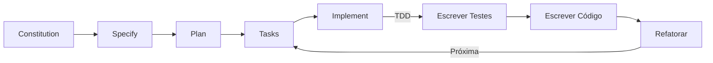
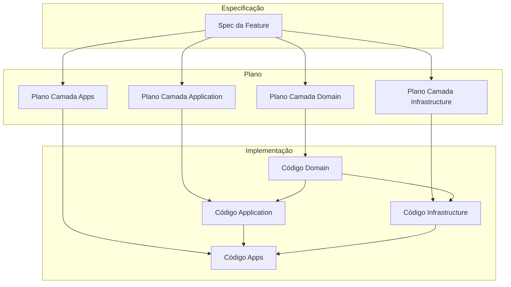
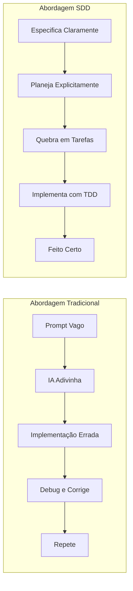

# Spec-Driven Development (SDD) com Spec Kit (PT)

## Propósito

Prevenir o "problema do prompt vago" onde agentes de IA fazem suposições erradas, usando uma **abordagem estruturada de especificação primeiro** que se alinha perfeitamente com os princípios de Clean Architecture.

## Quando usar

Use Spec-Driven Development sempre que você:

- Adicionar uma nova funcionalidade ao projeto
- Fazer mudanças arquiteturais significativas
- Precisar de assistência precisa de IA para implementações complexas
- Quiser documentar a tomada de decisões para o time

## O Problema: Prompts Vagos

O desenvolvimento tradicional assistido por IA geralmente se parece com isso:

```
Desenvolvedor: "Adicione autenticação de usuário no meu app"

IA: *adivinha*
- OAuth? JWT? Cookies de sessão?
- Onde armazenar tokens?
- Quais campos de usuário são necessários?
- Qual camada cuida de quê?
- Como estruturar a API?

Resultado: Implementação errada, tempo perdido, violações arquiteturais
```

A IA é forçada a tomar milhares de decisões implícitas porque o prompt não tem especificidade. Em um projeto Clean Architecture, isso é especialmente perigoso porque:

1. **Limites de camadas são rígidos** — palpites errados causam violações de dependência
2. **Padrões são obrigatórios** — Result Pattern, schemas Zod, etc. devem ser seguidos
3. **Testes são obrigatórios** — TDD requer especificações claras antes dos testes
4. **Consistência importa** — convenções de nomenclatura e estrutura de arquivos têm regras

## A Solução: Spec-Driven Development

SDD inverte o jogo. Em vez de pedir para a IA implementar vagamente, você primeiro **especifica precisamente o que quer**, depois deixa a IA executar com clareza:

```
Desenvolvedor: Usa /speckit.specify para definir:
- Exatamente o que autenticação significa (JWT, não OAuth)
- Campos da entidade usuário (id, email, name, createdAt)
- Quais camadas cuidam de quê
- Cenários de erro e validações
- Integração com padrões existentes

IA: Entende completamente
- Segue a especificação exatamente
- Respeita limites arquiteturais
- Implementa com padrões corretos
- Escreve testes adequados

Resultado: Implementação correta na primeira vez
```

## Por que SDD para Este Projeto?

### 1. Clean Architecture Exige Precisão

Clean Architecture tem separação rígida de camadas:

```
Domain → Application → Infrastructure → Apps
```

Cada camada tem responsabilidades específicas. SDD garante:

- **Limites de domínio são claros**: Definições de entidades, interfaces de repositórios
- **Lógica de aplicação é explícita**: Use cases, hooks, factories
- **Infraestrutura é separada**: Implementações Apollo, mappers
- **Apps apenas compõem**: Wiring do Composition Root

Sem especificações, a IA pode:

- Colocar lógica de negócio em componentes (viola Domain)
- Importar infraestrutura na aplicação (viola Inversão de Dependência)
- Pular o Result Pattern (viola regras de tratamento de erro)
- Criar hooks monolíticos (viola Responsabilidade Única)

### 2. TDD Requer Especificações Claras

Test-Driven Development precisa de **critérios de aceitação claros** antes de escrever testes:

```
❌ Sem SDD:
"Escreva testes para autenticação de usuário"
→ Quais cenários? Quais casos extremos? O que é sucesso?

✅ Com SDD:
Especificação define:
- Sucesso: credenciais válidas → retorna User
- Falha: email inválido → retorna ValidationError
- Falha: senha errada → retorna AuthenticationError
- Extremo: falha de rede → retorna NetworkError

→ Testes se escrevem a partir da spec
```

### 3. Valor Educacional

Este boilerplate é educacional. SDD cria:

- **Histórico de decisões documentado**: Por que esta abordagem?
- **Requisitos rastreáveis**: O que foi pedido vs implementado
- **Material de aprendizado**: Novos desenvolvedores entendem o raciocínio

### 4. Consistência em Escala

Conforme funcionalidades crescem, consistência fica mais difícil. A **Constitution** garante que toda funcionalidade siga os mesmos princípios, independente de quando ou por quem foi adicionada.

## Como o Spec Kit Funciona

Spec Kit fornece um workflow estruturado com 5 fases principais:



### Fase 1: Constitution (`/speckit.constitution`)

A **Constitution** define princípios imutáveis do projeto. Pense nela como a "lei" que todas as funcionalidades devem seguir.

Localização: `.specify/memory/constitution.md`

Para este boilerplate, a Constitution impõe:

- Separação de camadas Clean Architecture
- Result Pattern para tratamento de erros
- TDD como prática obrigatória
- Apollo Client para busca de dados
- Zod para validação de entidades

**Quando atualizar**: Raramente. Apenas quando princípios fundamentais do projeto mudam.

### Fase 2: Specify (`/speckit.specify`)

A **Especificação** captura **o que** você quer e **por quê**.

Esta fase produz um documento detalhado respondendo:

- O que é a funcionalidade?
- Quem usa?
- Quais são as entradas/saídas?
- Quais são os critérios de sucesso?
- Quais são os casos extremos?
- Quais são as restrições?

**Exemplo de saída** (`.specify/memory/spec.md`):

```markdown
# Especificação da Funcionalidade User Profile

## Visão Geral

Permitir que usuários visualizem e atualizem suas informações de perfil.

## Histórias de Usuário

- Como usuário, quero ver meus detalhes de perfil
- Como usuário, quero atualizar meu nome e avatar

## Entidades

- User: id, email, name, avatarUrl, createdAt

## Operações

- getProfile(): Retorna o perfil do usuário atual
- updateProfile(name, avatarUrl): Atualiza perfil, retorna User atualizado

## Cenários de Erro

- NetworkError: API inacessível
- ValidationError: Entrada inválida (nome muito curto, URL inválida)
- AuthenticationError: Usuário não autenticado

## Restrições

- Deve usar Zod para validação
- Deve retornar tipos Result
- Deve seguir camadas Clean Architecture
```

### Fase 3: Plan (`/speckit.plan`)

O **Plano** define **como** implementar a especificação.

Esta fase mapeia requisitos para sua arquitetura:

```markdown
# Plano de Implementação User Profile

## Camada Domain

- Criar UserProfileSchema (Zod)
- Criar UserProfileRepositoryInterface
- Criar contratos useGetProfile e useUpdateProfile

## Camada Application

- Criar GetProfileUseCase
- Criar UpdateProfileUseCase
- Criar hook useProfile (orquestração)

## Camada Infrastructure

- Criar UserProfileMapper
- Criar ApolloUserProfileRepository
- Criar hook useApolloGetProfile
- Criar hook useApolloUpdateProfile

## Camada GraphQL

- Adicionar query GetProfile
- Adicionar mutation UpdateProfile

## Camada Apps

- Conectar no Composition Root
- Criar componente ProfileScreen
```

### Fase 4: Tasks (`/speckit.tasks`)

**Tasks** quebra o plano em passos atômicos e acionáveis:

```markdown
## Tarefas

### Domain

- [ ] Criar schema de entidade UserProfile com Zod
- [ ] Escrever testes de validação para UserProfile
- [ ] Criar UserProfileRepositoryInterface
- [ ] Criar contratos de hook para operações de perfil

### Application

- [ ] Escrever testes GetProfileUseCase (red)
- [ ] Implementar GetProfileUseCase (green)
- [ ] Escrever testes UpdateProfileUseCase (red)
- [ ] Implementar UpdateProfileUseCase (green)
- [ ] Criar hook useProfile

### Infrastructure

- [ ] Criar UserProfileMapper com testes
- [ ] Implementar ApolloUserProfileRepository
- [ ] Criar implementações de hook Apollo

### Apps

- [ ] Adicionar operações GraphQL
- [ ] Conectar Composition Root
- [ ] Criar componente ProfileScreen
```

### Fase 5: Implement (`/speckit.implement`)

Execute tarefas uma por uma, seguindo TDD:

1. **Red**: Escreva teste falhando baseado na tarefa
2. **Green**: Implemente código mínimo para passar
3. **Refactor**: Limpe mantendo testes verdes
4. **Repita**: Vá para próxima tarefa

## Exemplo Prático: Adicionando User Profile

Vamos percorrer um exemplo completo:

### Passo 1: Definir Constitution (feito uma vez)

```markdown
# Vita Product Boilerplate Constitution

## Princípios Fundamentais

### I. Clean Architecture (INEGOCIÁVEL)

Separação rígida de camadas:

- Domain: Lógica de negócio pura (schemas Zod, interfaces)
- Application: Use cases + React hooks
- Infrastructure: Implementações Apollo + mappers
- Apps: Apenas composition root

### II. Result Pattern (INEGOCIÁVEL)

Nunca lance exceções - retorne Result<T, E>.

### III. Test-Driven Development (INEGOCIÁVEL)

Testes primeiro, implementação segundo, refatoração terceiro.

### IV. Apollo Client Primeiro

GraphQL via Apollo Client, não React Query.

### V. Zod Primeiro

Todas entidades são schemas Zod.
```

### Passo 2: Especificar a Funcionalidade

Use `/speckit.specify` no Cursor:

```
Quero adicionar uma funcionalidade User Profile que:
- Mostra nome, email e avatar do usuário
- Permite atualizar nome e avatar (não email)
- Valida tamanho do nome (2-50 caracteres)
- Valida formato de URL do avatar
- Retorna erros apropriados para cada caso de falha
```

### Passo 3: Gerar Plano

Use `/speckit.plan` para criar plano de implementação:

```
Baseado na especificação, crie um plano que:
- Siga as camadas Clean Architecture
- Use abordagem TDD
- Integre com padrões existentes
```

### Passo 4: Gerar Tarefas

Use `/speckit.tasks` para quebrar em tarefas:

```
Quebre o plano em tarefas atômicas adequadas para TDD.
Cada tarefa deve ser completável em uma sessão.
```

### Passo 5: Implementar com TDD

Use `/speckit.implement` ou execute tarefas manualmente:

```typescript
// Tarefa 1: Criar entidade UserProfile (Domain)

// Teste primeiro (Red)
describe('UserProfileSchema', () => {
  it('deve validar um perfil válido', () => {
    const result = UserProfileSchema.safeParse({
      id: '123',
      email: 'user@example.com',
      name: 'João Silva',
      avatarUrl: 'https://example.com/avatar.jpg',
      createdAt: new Date(),
    });
    expect(result.success).toBe(true);
  });

  it('deve rejeitar nome menor que 2 caracteres', () => {
    const result = UserProfileSchema.safeParse({
      id: '123',
      email: 'user@example.com',
      name: 'J',
      avatarUrl: null,
      createdAt: new Date(),
    });
    expect(result.success).toBe(false);
  });
});

// Implementação (Green)
export const UserProfileSchema = z.object({
  id: z.string(),
  email: z.string().email(),
  name: z.string().min(2).max(50),
  avatarUrl: z.string().url().nullable(),
  createdAt: z.coerce.date(),
});

export type UserProfile = z.infer<typeof UserProfileSchema>;
```

## Integração com Camadas Clean Architecture

SDD mapeia naturalmente para Clean Architecture:



### Responsabilidades de Camada em SDD

| Fase SDD  | Domain                                  | Application                | Infrastructure          | Apps                 |
| --------- | --------------------------------------- | -------------------------- | ----------------------- | -------------------- |
| Specify   | Campos de entidade, regras de validação | Comportamentos de use case | Formato de API externa  | Requisitos de UI     |
| Plan      | Schemas Zod, interfaces                 | Use cases, hooks           | Mappers, repositórios   | Componentes, wiring  |
| Tasks     | Schema + testes                         | UC + testes                | Mapper + testes de repo | Testes de integração |
| Implement | TDD para entidades                      | TDD para use cases         | TDD para mappers        | Implementação de UI  |

## Comparação: Tradicional vs SDD



| Aspecto                   | Tradicional           | SDD                   |
| ------------------------- | --------------------- | --------------------- |
| Esforço inicial           | Baixo (prompt rápido) | Médio (escrever spec) |
| Precisão da IA            | Baixa (adivinha)      | Alta (segue spec)     |
| Conformidade arquitetural | Aleatória             | Garantida             |
| Tempo de debug            | Alto                  | Baixo                 |
| Documentação              | Nenhuma               | Embutida              |
| Reprodutibilidade         | Baixa                 | Alta                  |
| Alinhamento do time       | Pobre                 | Excelente             |

## Boas Práticas

### Escrevendo Boas Especificações

1. **Seja explícito sobre restrições**: "Deve usar Zod para validação"
2. **Defina cenários de erro**: "O que acontece se X falhar?"
3. **Especifique limites**: "Apenas camada Domain valida entidades"
4. **Inclua exemplos**: "Nome como 'João Silva', não 'J'"

### Escrevendo Boas Constitutions

1. **Foque em princípios, não implementações**: "Use Result Pattern" não "Retorne { ok: true, value }"
2. **Marque inegociáveis claramente**: Tag "(INEGOCIÁVEL)"
3. **Mantenha estável**: Mude raramente, apenas para mudanças fundamentais
4. **Seja conciso**: Constitution deve caber em uma página

### Usando Comandos Efetivamente

| Comando                 | Quando                                       | Duração   |
| ----------------------- | -------------------------------------------- | --------- |
| `/speckit.constitution` | Uma vez por projeto, ou mudança de princípio | 5-10 min  |
| `/speckit.specify`      | Antes de cada funcionalidade                 | 10-20 min |
| `/speckit.clarify`      | Se spec tem ambiguidades                     | 5-10 min  |
| `/speckit.plan`         | Após spec estar completa                     | 5-10 min  |
| `/speckit.tasks`        | Após plano estar aprovado                    | 5-10 min  |
| `/speckit.implement`    | Para cada tarefa                             | Varia     |
| `/speckit.analyze`      | Antes da implementação, para validação       | 5-10 min  |

## Erros Comuns

### 1. Especificar Demais

❌ **Muito detalhado**: Especificar nomes exatos de variáveis, números de linha
✅ **Ideal**: Especificar comportamentos, restrições, cenários de erro

### 2. Pular Clarificação

❌ **Ruim**: Pular da spec para implementação com ambiguidades
✅ **Bom**: Usar `/speckit.clarify` para resolver áreas obscuras

### 3. Ignorar Constitution

❌ **Ruim**: Permitir que funcionalidade viole princípios "só dessa vez"
✅ **Bom**: Atualizar constitution se princípio realmente precisa mudar

### 4. Não Atualizar Spec

❌ **Ruim**: Requisitos mudam mas spec fica velha
✅ **Bom**: Spec é documento vivo, atualizado conforme entendimento cresce

### 5. Tarefas Gigantes

❌ **Ruim**: "Implementar autenticação" como uma tarefa
✅ **Bom**: Quebrar em tarefas de entidade, repositório, use case, hook, UI

## Integração com Ferramentas Existentes

### Com Workflow TDD

SDD e TDD são complementares:

1. **Spec** → Define o que testar
2. **Plan** → Mapeia testes para camadas
3. **Tasks** → Cada tarefa recebe Red-Green-Refactor
4. **Implement** → Execução TDD

### Com Gerador de Features

Use SDD primeiro, depois o gerador:

```bash
# 1. Complete fases SDD (specify, plan, tasks)
# 2. Gere estrutura da feature
./scripts/generate-feature.sh user-profile

# 3. Implemente tarefas na estrutura gerada
```

### Com Cursor Rules

Constitution do SDD complementa `.cursor/rules/`:

- **Constitution**: Princípios e restrições de alto nível
- **Cursor Rules**: Detalhes técnicos de implementação

Ambos são respeitados durante `/speckit.implement`.

## Estrutura de Arquivos

Após executar `specify init --here`:

```
.specify/
├── memory/
│   ├── constitution.md    # Princípios do projeto (editar uma vez)
│   ├── spec.md           # Spec da feature atual (gerada)
│   ├── plan.md           # Plano de implementação (gerado)
│   └── tasks.md          # Quebra de tarefas (gerado)
├── scripts/
│   └── bash/             # Scripts auxiliares
└── templates/            # Templates de documentos
```

## Links

- [Repositório Spec Kit](https://github.com/github/spec-kit)
- [Artigo Spec-Driven Development](https://github.blog/ai-and-ml/generative-ai/spec-driven-development-with-ai-get-started-with-a-new-open-source-toolkit/)
- [Clean Architecture (Robert C. Martin)](https://blog.cleancoder.com/uncle-bob/2012/08/13/the-clean-architecture.html)
- [Workflow TDD](./tdd.pt.md)
- [Adicionando uma Feature](./adding-a-feature.pt.md)
